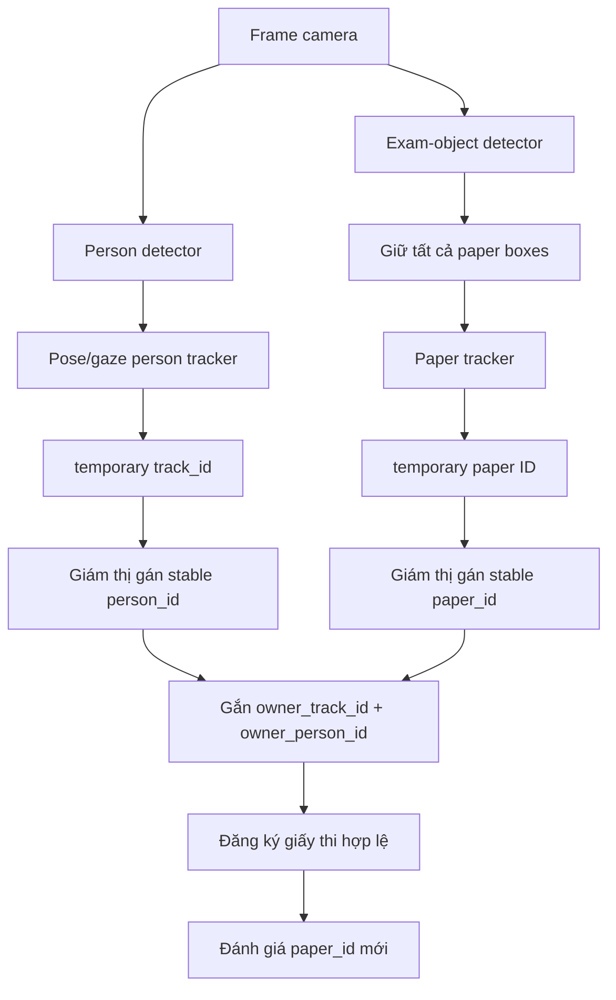

# Theo dõi giấy thi và phát hiện giấy lạ

## Vấn đề của pipeline cũ

Checkpoint `weights/yolov8_finetuned.pt` hiện có bốn class:

- `smartwatch`
- `earphone`
- `cheat_sheet`
- `smartphone`

Nó chưa có class `test_paper`. Vì vậy một tờ giấy thi bình thường cũng có thể bị
gán nhãn `cheat_sheet`. Pipeline cũ còn có hai vấn đề:

1. Chỉ giữ box có confidence cao nhất của mỗi class, nên mất box khi có hai tờ
   giấy cùng class.
2. Đếm theo tên class thay vì theo vật thể. Nếu cùng một tờ giấy đổi nhãn giữa
   các frame, hệ thống không biết đó vẫn là vật thể cũ.

## Luồng xử lý mới



Quy tắc quan trọng là **identity first, classification second**:

- `track_id` là handle nội bộ; `person_id` do giám thị nhập mới là định danh ổn
  định cần hiển thị/lưu.
- Tracker dùng IoU và khoảng cách tâm để giữ track khi người di chuyển mạnh.
- Khi gán `person_id`, pipeline ghi nhớ fingerprint vùng mặt/quần áo. Người quay
  lại sau khi mất dấu lâu được tự khôi phục numeric `track_id`, `person_id` và
  paper ownership; người khác ở cùng vị trí nhận ID tạm mới.
- ID giấy mới detect chỉ là ID tạm. Giám thị nhập `paper_id` số dương cố định;
  API đánh dấu `paper_id_assigned=true` và `paper_id_source=manual`.
- Pipeline tạo appearance fingerprint từ bố cục DCT và cấu trúc cạnh/chữ của crop
  giấy, rồi đăng ký fingerprint theo owner.
- Nếu đề thi bị re-track sau khi mất dấu lâu, fingerprint + owner khớp sẽ tự phục
  hồi `paper_id`, authorization và bộ đếm cảnh báo cũ.
- Paper có fingerprint khác không được kế thừa ID dù xuất hiện đúng vị trí cũ;
  nó tạo alert `additional_paper`/`paper_replacement` kèm `owner_person_id`.
- Tracker ghép box bằng IoU, khoảng cách tâm và tỉ lệ diện tích, không yêu cầu
  class phải giống nhau.
- Cùng một tờ giấy giữ nguyên `paper_id` khi model đổi
  `test_paper -> cheat_sheet -> test_paper`.
- Mỗi giấy được liên kết với `owner_track_id` của thí sinh gần nhất.
- Giấy thi hợp lệ được đăng ký theo cặp `(owner_track_id, paper_id)`.
- Một `paper_id` khác của cùng thí sinh là giấy bổ sung và chỉ phát cảnh báo sau
  nhiều lần inference liên tiếp.

## Hai chế độ model

| Checkpoint | Cách hệ thống xử lý |
| --- | --- |
| Model 4 class hiện tại | Mọi box giấy được đưa về `stable_label=paper_unknown`. Không dùng nhãn `cheat_sheet` để kết luận; dùng `paper_id`, chủ sở hữu và số lượng giấy. |
| Model 6 class sau khi train lại | Làm mượt nhãn `test_paper/cheat_sheet` theo thời gian, đồng thời vẫn dùng quy tắc `paper_id` bổ sung. |

Tracking khắc phục nhầm lẫn theo thời gian nhưng không thay thế hoàn toàn việc
train lại. Model 6 class vẫn nên được train từ `yolov8s.pt` với các class:
`smartwatch`, `earphone`, `cheat_sheet`, `smartphone`, `calculator`,
`test_paper`; không resume trực tiếp checkpoint 4 class đã học bias
“giấy = cheat_sheet”.

## Quy trình sử dụng an toàn

1. Bắt đầu session ở chế độ `SETUP`.
2. Nhập `person_id` cố định cho từng người ngay trong cửa sổ camera.
3. Nhập `paper_id` số dương cố định cho từng giấy ngay trong cửa sổ camera.
4. Trên bàn mỗi thí sinh chỉ để tờ giấy thi hợp lệ.
5. Chờ giấy tồn tại đủ `paper_registration_frames`; box chuyển sang xanh với
   trạng thái `authorized_exam_paper`.
6. Arm session để khóa đăng ký. Sau thời điểm này, hệ thống không tự cho phép
   `paper_id` mới.
7. Khi một giấy khác xuất hiện, gán ID khác; trạng thái đi từ `watching` sang `suspicious`
   sau `paper_alert_confirm_frames` lần inference.

Không nên để cheat sheet xuất hiện trong giai đoạn `SETUP`, vì model 4 class
không có đủ thông tin semantic để biết tờ giấy đầu tiên có hợp lệ hay không.
Trong môi trường thật, giám thị nên kiểm tra giấy đã đăng ký rồi mới arm.

## Chạy webcam end-to-end

Từ thư mục gốc dự án:

```powershell
python -m backend.ai_services.object_detect.test_paper_tracking_webcam
```

Phím điều khiển:

- `A`: khóa/arm đăng ký giấy.
- `D`: mở lại chế độ đăng ký.
- `Q` hoặc `Esc`: thoát.

Cửa sổ camera sẽ hỏi ID cho mỗi người chưa được gán. Giữ focus tại cửa sổ, gõ ID
như `SV001` rồi nhấn `Enter`. Label `memory=on` cho biết fingerprint người đã
được lưu; khi người đó rời camera lâu rồi quay lại, hệ thống tự khôi phục track
và ID ban đầu. Nếu hình ảnh không đủ rõ, nhập lại đúng ID cũ là fallback thủ công.

Cửa sổ cũng hỏi ID cho giấy chưa được gán. Nhập số dương như `101` rồi `Enter`.
`Backspace` dùng để sửa, `Esc` bỏ qua detection tạm. Trước khi gán, overlay hiện
`UNASSIGNED temp_paper=...`; sau khi gán mới hiện `paper_id=101`. Demo chặn `A`
nếu còn person hoặc paper chưa gán. Sau khi fingerprint đã đăng ký, đưa đúng đề
thi trở lại sẽ tự nhận `paper_id=101` mà không hỏi lại.
Overlay `memory=on` xác nhận fingerprint đã lưu. Demo không cho arm nếu person
hoặc paper đã gán ID nhưng vẫn `memory=off`; cần làm rõ mặt/thân, crop giấy hoặc
cải thiện ánh sáng.

Màu hiển thị:

| Màu/trạng thái | Ý nghĩa |
| --- | --- |
| Xanh lá — `authorized_exam_paper` | Đúng `paper_id` đã đăng ký cho thí sinh. |
| Vàng — `registration_pending` | Giấy mới, chưa đủ số frame để đăng ký/kết luận. |
| Cam — `watching` | Có dấu hiệu giấy lạ nhưng chưa đủ frame xác nhận. |
| Đỏ — `suspicious` | Giấy lạ đã được xác nhận theo thời gian. |

## Tích hợp bằng Python

```python
from pathlib import Path

from backend.ai_services.object_detect.object_detect import ObjectDetectModule
from backend.ai_services.pose_gaze.paper_pipeline import PoseGazePaperPipeline
from backend.ai_services.pose_gaze.tracking.detectors import (
    UltralyticsPersonDetector,
)

person_detector = UltralyticsPersonDetector(
    Path("weights/yolov8n.pt"),
    confidence_threshold=0.55,
)
object_detector = ObjectDetectModule()
pipeline = PoseGazePaperPipeline(
    person_detector=person_detector,
    object_detector=object_detector,
    max_people=2,
)

pipeline.create_session("exam_room_01")
result = pipeline.process_frame(
    frame,
    session_id="exam_room_01",
    frame_id=frame_id,
)

temporary_paper_id = result["papers"][0]["paper_id"]
pipeline.assign_paper_id(
    "exam_room_01",
    current_paper_id=temporary_paper_id,
    stable_paper_id=101,
)

for alert in result["alerts"]:
    if alert["source"] == "paper_tracking":
        print(alert["paper_id"], alert["owner_track_id"], alert["reasons"])
```

## REST API cho dashboard

Gán person ID do giám thị chọn (`student_id` cũ vẫn được chấp nhận):

```http
PUT /api/pose-gaze/sessions/exam-room-01/tracks/1/assignment
Content-Type: application/json

{"person_id": "SV001"}
```

Gán ID giấy cố định cho paper track tạm:

```http
PUT /api/pose-gaze/sessions/exam-room-01/papers/1/identity
Content-Type: application/json

{"stable_paper_id": 101}
```

Object service chỉ gửi paper detections khi YOLO thực sự inference, không gửi
lại kết quả cache ở frame bị skip:

```http
POST /api/pose-gaze/sessions/exam-room-01/paper-detections
Content-Type: application/json

{
  "supports_test_paper": false,
  "detections": [
    {
      "bbox_xyxy": [120, 410, 310, 590],
      "confidence": 0.86,
      "class_name": "cheat_sheet"
    }
  ]
}
```

Xem paper ID và trạng thái:

```http
GET /api/pose-gaze/sessions/exam-room-01/papers
```

Đăng ký thủ công giấy thi:

```http
PUT /api/pose-gaze/sessions/exam-room-01/papers/1/authorization
Content-Type: application/json

{
  "owner_track_id": 1,
  "replace_existing": false
}
```

Khóa đăng ký:

```http
POST /api/pose-gaze/sessions/exam-room-01/paper-monitoring/arm
```

## Tham số cần hiệu chỉnh

Trong `backend/core/config.py`:

| Tham số | Mặc định | Ý nghĩa |
| --- | ---: | --- |
| `paper_detection_confidence_threshold` | `0.30` | Ngưỡng giữ box giấy để tracker có dữ liệu liên tục. |
| `object_detect_every_n_frames` | `3` | YOLO object chạy mỗi ba frame camera. |
| `person_appearance_match_threshold` | `0.78` | Ngưỡng cosine để người quay lại được tự khôi phục ID. |
| `paper_registration_frames` | `5` | Số lần inference cần thấy giấy trước khi tự đăng ký. |
| `paper_alert_confirm_frames` | `3` | Số lần inference nghi ngờ liên tiếp trước khi cảnh báo. |
| `paper_max_missed_frames` | `12` | Số lần inference cho phép giấy bị che trước khi xóa track. |
| `paper_auto_register_first` | `True` | Tự đăng ký giấy ổn định đầu tiên trong chế độ setup. |
| `paper_appearance_match_threshold` | `0.86` | Ngưỡng cosine để fingerprint được xem là cùng tờ giấy. |

Các giá trị trên tính theo **lần YOLO inference**, không phải frame camera. Với
`object_detect_every_n_frames=3`, đăng ký 5 lần inference tương đương khoảng 15
frame camera; cảnh báo 3 lần inference tương đương khoảng 9 frame camera.

## Giới hạn cần lưu ý

- Với checkpoint 4 class, hệ thống chỉ biết “đây là một vật thể giấy”, không thể
  chứng minh nội dung tờ giấy là hợp lệ.
- Nếu đề thi hợp lệ có nhiều tờ, cần đăng ký đúng từng tờ hoặc thay đổi chính
  sách số giấy cho phép; mặc định hiện tại là một tờ cho mỗi thí sinh.
- Appearance re-ID cần crop có đủ chữ/hình/bố cục. Với giấy trắng, ảnh mờ, che
  nhiều hoặc góc nhìn thay đổi rất lớn, hệ thống giữ ID tạm để giám thị xác minh
  thay vì tự gán nhầm đề thi.
- Person appearance re-ID dùng vùng mặt/quần áo trong cùng session, không phải
  xác thực sinh trắc học. Khi crop nhỏ/mờ, che mặt, thay áo hoặc góc nhìn thay đổi
  quá lớn, hệ thống giữ ID tạm để giám thị xác nhận lại.
- Box giấy cần đủ tách biệt. Hai tờ chồng gần như hoàn toàn có thể chỉ tạo một
  detection, nên không thể suy ra có hai vật thể từ một box duy nhất.
