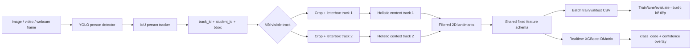

# Pose/Gaze: tracking, Holistic, dataset CSV và realtime XGBoost

Tài liệu này là đặc tả vận hành đầy đủ của module
`backend/ai_services/pose_gaze` trong repo
`Real-Time-Exam-Proctoring-System-local`: kiến trúc, cấu hình, hợp đồng dữ liệu,
cách chạy tracking/Holistic, batch ảnh thành CSV, contract train model và demo
realtime XGBoost.

> Cập nhật: 03/08/2026. Module đã có person detection/tracking, session
> persistence, gán ID, MediaPipe Holistic theo track, landmark schema hai chiều,
> batch exporter `train/val/test.csv` và runtime nạp model XGBoost đã train.
> Chưa có model đã train, bước extract frame/label tự động, feature hình học nâng
> cao hoặc temporal-window training.

## 1. Phạm vi module

Module này chịu trách nhiệm:

1. Nhận bbox class `person` từ YOLO/HOG.
2. Association bbox qua thời gian để tạo `track_id` ổn định.
3. Ánh xạ `track_id` với `student_id` theo session.
4. Crop riêng từng người đang hiện diện.
5. Chạy một MediaPipe Holistic context riêng cho từng `track_id`.
6. Giữ hai bàn tay đầy đủ; pose bỏ nửa thân dưới; chỉ giữ điểm mặt cần cho
   miệng, trán và trục hỗ trợ hướng đầu.
7. Áp dụng confidence gate và xuất landmark hai chiều, không có `z`.
8. Batch hàng nghìn ảnh thành schema CSV cố định cho train/validation/test.
9. Giữ metadata annotation tách khỏi feature model để tránh target leakage.
10. Nạp model XGBoost đã train và classification từng track trên webcam.

Không nằm trong module này:

- Detect phone hoặc vật thể gian lận.
- Face recognition để nhận dạng danh tính.
- Audio/Whisper.
- Script train/tune/evaluate và model XGBoost đã train.
- Extract frame từ video theo interval annotation.
- Mapping tự động `actor_id`/`action_actor_ids` sang `track_id`.
- Feature hình học nâng cao và temporal-window aggregation.
- Quyết định kỷ luật tự động. Kết quả chỉ nên là tín hiệu cảnh báo/evidence cho giám thị.

## 2. So sánh phiên bản trước và sau

| Hạng mục | Baseline không có `-local` | Bản `-local` hiện tại |
|---|---|---|
| Person tracker | Greedy IoU cơ bản | Greedy IoU đã bảo vệ association trước khi lấp slot mới |
| Người thứ ba confidence cao | Detection bị cắt trước association, có thể làm sinh viên biến mất | Associate toàn bộ detection trước; có regression test bảo vệ track cũ |
| Persistence | Chủ yếu ghi assignment | Ghi/đọc tracker state, bbox, next ID, frame, timestamp và assignment |
| Restart backend | Không restore đầy đủ | Restore đúng session được yêu cầu |
| Grace period | `has_track()` coi track mất tạm là đang hoạt động | Dùng `is_track_present()`; cho phép remap về ID cũ |
| Webcam test | Logic detector/tracker gắn trong script | `PersonTrackingModule` tái sử dụng được và CLI riêng |
| Session webcam | ID cố định hoặc dễ dùng lại ngoài ý muốn | Mặc định sinh ID mới; chỉ restore khi truyền `--session-id` |
| Nhập student ID | Luồng nhập dễ block/mất phím | Controller không blocking, nhận phím từ OpenCV và terminal Windows |
| Điều chỉnh FPS | Chưa giới hạn rõ toàn pipeline | Giới hạn nguyên 1–60 FPS cho cả vòng lặp; `+`/`-` chỉnh khi chạy |
| MediaPipe | Chưa có extractor thật | Legacy Holistic hoặc Tasks HolisticLandmarker theo từng track |
| Bbox đổi kích thước | Có thể làm graph smoothing lỗi | Letterbox mỗi crop về canvas vuông cố định rồi map ngược tọa độ |
| Nhiều người | Dễ dùng chung context hoặc lệch mapping | Một processor riêng cho mỗi `track_id`; output giữ ID rõ ràng |
| Test ảnh/video | Chưa có pipeline hoàn chỉnh | Có `holistic/test_media/test_media.py`, auto assign ID và annotated output |
| JSON landmarks | Chưa có | Có writer dạng nhiều dòng/stream; có thể tắt bằng flag |
| Landmark payload | Nhiều điểm/chiều sâu dư | Chỉ materialize index dùng, schema `x/y`, confidence ba mức |
| Batch dataset | Chưa có | Stream ảnh thành `train.csv`, `val.csv`, `test.csv` |
| Split sequence | Chưa có | Hash theo sequence hoặc đọc `split_group/split` từ manifest |
| XGBoost runtime | Chưa có | Feature contract chung, model validation và webcam classification |
| Unit tests | Ít case nền tảng | 36 test tracking, landmark, CSV, batch và realtime helpers |

Các file chỉ có ở bản `-local` (bản phát triển thêm ở commit mới):

```text
settings/settings.py
holistic/landmark/landmarks.py
holistic/feature_csv/feature_csv.py
holistic/batch_dataset/batch_dataset.py
holistic/test_webcam/test_webcam.py
holistic/test_media/test_media.py
holistic/tests/test_landmarks/test_landmarks.py
holistic/README.md
main/main.py
main/model/model_metadata.example.json
tracking/webcam/webcam.py
tracking/interactive/interactive.py
tracking/test_image/test_image.py
tracking/README.md
```

File `pose_gaze_test.py` ở baseline là mock cũ và không còn nằm trong bản `-local`.

## 3. Kiến trúc hiện tại



Nguyên tắc mapping bắt buộc:

```text
session_id -> frame_id -> track_id -> student_id -> bbox -> landmarks
```

`HolisticLandmarkExtractor.process_packet()` duyệt mọi track có `is_present=true`. Mỗi track có processor và timestamp riêng. Vì vậy kết quả người thứ hai không được gán sang người thứ nhất; nếu một bbox không có pose, output của track đó có thể rỗng hoặc bị bỏ qua khi MediaPipe ném lỗi, nhưng `track_id` của track khác không bị đổi.

Hai chế độ dùng chung cùng landmark/feature contract nhưng khác vòng đời tracker:

| Chế độ | Vòng đời tracker | Output chính |
|---|---|---|
| Webcam/video | Theo session hoặc toàn video | `TrackPacket`, JSON, overlay |
| Batch ảnh độc lập | Reset cho từng ảnh | Một hoặc nhiều hàng CSV mỗi ảnh |
| Batch frame sequence | Giữ theo `sequence_id` | Track ID ổn định xuyên frame của sequence |

Với dataset nhiều người, `class_code` thuộc annotation của sample chưa tự động
có nghĩa là mọi track đều là action actor. `action_actor_ids` được giữ nguyên
trong CSV nhưng phải được map sang `track_id` trước khi chọn hàng train.

### 3.1 Phân biệt detector confidence và tracker IoU

Luồng truyền cấu hình của pipeline chuẩn:

```text
CLI -> PersonTrackingConfig -> PersonTrackingModule
    -> UltralyticsPersonDetector(confidence_threshold)
    -> TrackingManager(min_iou, max_missed_frames)
    -> IoUPersonTracker
```

Các default dùng chung nằm tại `settings/settings.py`:

| Giá trị | Default | Tác dụng |
|---|---:|---|
| `confidence_threshold` | `0.50` | YOLO có trả bbox class `person` hay không |
| `min_iou` | `0.30` | Detection person có được nối với track cũ hay không |
| `max_missed_frames` | `30` | Số frame xử lý giữ track không thấy trước khi xóa |
| `holistic_confidence` | `0.50` | Ngưỡng detection/tracking và landmark chuẩn của Holistic |
| `soft_landmark_confidence` | `0.20` | Ngưỡng mềm để còn giữ tọa độ dự đoán |

`min_iou` không quyết định một vật thể có phải `person`; cái đèn bị nhận thành người là false positive của YOLO và cần chỉnh `--confidence` hoặc model. IoU chỉ chạy sau detector, khi detection đã mang class `person`.

Logic tracker hiện tại đưa mọi track chưa hết hạn vào danh sách ghép IoU, kể cả track đang có `is_present=false`. Vì vậy trong tối đa 30 frame xử lý, một người mới xuất hiện ở bbox cũ vẫn có thể nhận ID cũ nếu IoU đạt ngưỡng. Ở 10 inference FPS, khoảng này xấp xỉ 3 giây; ở 5 FPS là khoảng 6 giây. Tăng `min_iou` chỉ giảm một phần rủi ro và có thể làm ID bị đứt khi bbox rung. Muốn ngăn tuyệt đối cần thay logic association/ReID; phần đó chưa được sửa trong thay đổi tham số này.

## 4. Cấu trúc file chính

| File | Vai trò |
|---|---|
| `tracking/detectors/detectors.py` | Adapter OpenCV HOG và Ultralytics YOLO, chỉ trả class `person` |
| `settings/settings.py` | Default dùng chung cho tracking và Holistic |
| `tracking/tracker/tracker.py` | Association IoU, grace period, remap và export/restore state |
| `tracking/manager/manager.py` | Session, assignment, persistence và JSON handoff |
| `tracking/schemas/schemas.py` | `BoundingBox`, `PersonDetection`, `TrackedPerson`, `TrackPacket` |
| `tracking/webcam/webcam.py` | Module tái sử dụng cho detect/tracking frame và webcam |
| `tracking/interactive/interactive.py` | Nhập ID, unassign, retry, save/quit và điều chỉnh FPS |
| `tracking/test_webcam/test_webcam.py` | CLI webcam chỉ person tracking |
| `holistic/landmark/landmarks.py` | Crop/letterbox, MediaPipe theo track, lọc/map/draw landmark |
| `holistic/test_webcam/test_webcam.py` | CLI webcam tracking + Holistic |
| `holistic/test_media/test_media.py` | CLI ảnh/video tracking + Holistic |
| `holistic/feature_csv/feature_csv.py` | Schema CSV/model feature cố định, không có `z` |
| `holistic/batch_dataset/batch_dataset.py` | Batch hàng nghìn ảnh thành `train/val/test.csv` |
| `main/main.py` | Webcam detect → track → landmark → XGBoost classification |
| `tracking/tests/test_tracking/test_tracking.py` | Unit/regression tests cho tracking/session |
| `holistic/tests/test_landmarks/test_landmarks.py` | Unit tests cho landmark/filter/confidence/letterbox/timestamp |
| `holistic/tests/test_feature_csv/test_feature_csv.py` | Test schema CSV/model feature |
| `holistic/tests/test_batch_dataset/test_batch_dataset.py` | Test manifest, split, sequence tracking và CSV stream |
| `main/tests/test_main/test_main.py` | Test decode output XGBoost và smoothing |
| `note.md` | Ghi chú phạm vi commit hiện tại |
| `spec.md` | Đặc tả mục tiêu Module 1 và lộ trình behavior reasoning |

## 5. Cài đặt

Chạy các lệnh từ thư mục gốc repo `Real-Time-Exam-Proctoring-System-local`.

```powershell
python -m venv .venv
.\.venv\Scripts\Activate.ps1
python -m pip install --upgrade pip
python -m pip install -r requirements.txt
```

Các dependency trực tiếp hiện có:

| Package | Ràng buộc |
|---|---|
| `fastapi` | `>=0.115,<1.0` |
| `uvicorn[standard]` | `>=0.30,<1.0` |
| `opencv-python` | `>=4.10,<5.0` |
| `numpy` | `>=1.26,<3.0` |
| `ultralytics` | `>=8.3,<9.0` |
| `mediapipe` | `==0.10.33` |
| `xgboost` | `>=2.1,<4.0` |

Kiểm tra đúng Python đang chạy và package đã cài vào cùng environment:

```powershell
python -c "import sys; print(sys.executable)"
python -c "import cv2, mediapipe, ultralytics, xgboost; print(cv2.__version__, mediapipe.__version__, ultralytics.__version__, xgboost.__version__)"
```

### 5.1 Model weights

YOLO mặc định phải tồn tại tại:

```text
<project-root>/weights/yolov8n.pt
```

`PersonTrackingModule` không tự fallback sang tên model online nếu file này thiếu. Có thể truyền model khác bằng `--model`, nhưng model phải có class tên chính xác `person`.

MediaPipe Tasks mặc định dùng:

```text
<project-root>/weights/mediapipe/holistic_landmarker.task
```

Nếu chưa có, lần chạy đầu sẽ tải model chính thức. Máy offline cần tải thủ công và dùng `--holistic-model`. File `*.pt` và `*.task` đang bị ignore bởi Git.

Realtime classifier mặc định tìm:

```text
<project-root>/backend/ai_services/pose_gaze/main/model/xgboost_model.ubj
<project-root>/backend/ai_services/pose_gaze/main/model/model_metadata.json
```

Hai artifact này không được tự sinh bởi runtime. Sau training cần copy model và
metadata vào đúng chỗ hoặc truyền `--xgboost-model`/`--model-metadata`. File mẫu
metadata nằm tại `main/model/model_metadata.example.json`.

## 6. Session và student ID

### 6.1 Quy tắc vòng đời session

- Không truyền `--session-id` khi chạy webcam: tạo ID mới dạng `webcam_tracking_<timestamp>_<8-hex>` hoặc `webcam_holistic_<timestamp>_<8-hex>`.
- Truyền `--session-id old_id`: restore đúng state đã lưu của `old_id`. Nếu không tồn tại sẽ báo lỗi; tham số này không có nghĩa là “tạo một custom ID mới”.
- Tạo fresh session trùng file state cũ bị từ chối để tránh ghi đè ngoài ý muốn.
- `close_session()` chỉ đóng state trong RAM và giữ snapshot trên đĩa.
- Chưa có `delete_session()` và router hiện chưa expose restore/close/delete.
- Khi restore, bbox và history được giữ để re-association, nhưng mọi track được đặt `is_present=false` cho đến khi frame mới xác nhận người đang có mặt.

### 6.2 Persistence

Thư mục mặc định của module webcam/media:

```text
<project-root>/test_data_tracking/<session_id>/
```

Các file:

- `tracking_state.json`: snapshot có version, tracker state, assignments, frame/timestamp cuối. State định kỳ được persist mỗi 30 frame; assignment được persist ngay.
- `pose_gaze_input.json`: handoff cuối khi tool kết thúc.

JSON dùng UTF-8, `ensure_ascii=false` và `indent=2` nên có nhiều dòng, dễ đọc và diff.

### 6.3 Student ID

Webcam cho phép nhập ID thủ công. Media test bỏ bước nhập tay và tự gán theo `track_id`:

```text
Track 1 -> student_01
Track 2 -> student_02
```

Đổi tiền tố bằng `--student-prefix SV_` sẽ tạo `SV_01`, `SV_02`. Đây chỉ là ID kỹ thuật cho test; trước khi train dữ liệu thật nên ánh xạ sang ID ẩn danh ổn định theo video/session.

## 7. Test webcam chỉ person tracking

Lệnh cơ bản:

```powershell
python -m backend.ai_services.pose_gaze.tracking.test_webcam
```

Ví dụ cấu hình:

```powershell
python -m backend.ai_services.pose_gaze.tracking.test_webcam `
  --camera 0 `
  --model .\weights\yolov8n.pt `
  --device cpu `
  --confidence 0.50 `
  --target-fps 8 `
  --max-tracks 2 `
  --min-iou 0.30 `
  --max-missed-frames 30 `
  --width 1280 `
  --height 720
```

> Trong PowerShell, ký tự nối dòng thật là dấu backtick. Trong ví dụ tài liệu này nó được hiển thị đúng ở cuối dòng.

### 7.1 Toàn bộ parameter

| Parameter | Kiểu | Mặc định | Ý nghĩa |
|---|---:|---:|---|
| `--camera` | int | `0` | OpenCV camera index |
| `--model` | path | `None` | YOLO weights; `None` dùng `weights/yolov8n.pt` |
| `--device` | string | `None` | Device Ultralytics, ví dụ `cpu`, `0`, `0,1`; `None` để Ultralytics tự chọn |
| `--confidence` | float | `0.50` | Ngưỡng YOLO person confidence; nên nằm trong [0,1] |
| `--target-fps` | int | `10` | Giới hạn toàn vòng lặp; controller làm tròn và clamp 1–60 |
| `--max-tracks` | int | `2` | Số người tối đa được giữ trong tracker; phải >=1 |
| `--min-iou` | float | `0.30` | IoU tối thiểu để nối person detection với track chưa hết hạn |
| `--max-missed-frames` | int | `30` | Số frame xử lý giữ track mất tạm trước khi xóa |
| `--session-id` | string | `None` | Có giá trị thì restore session cũ; bỏ qua để tạo fresh ID |
| `--width` | int | `None` | Yêu cầu chiều rộng camera; camera có thể chọn mode gần nhất |
| `--height` | int | `None` | Yêu cầu chiều cao camera; camera có thể chọn mode gần nhất |

### 7.2 Phím điều khiển

| Phím | Tác dụng |
|---|---|
| `A` | Chọn track đang thấy để assign/reassign student ID |
| `U` | Chọn track đang thấy để unassign |
| `R` | Xóa danh sách track đã chọn “no”, cho phép prompt lại |
| `F` | Lưu output cuối và thoát |
| `Q` | Thoát; khối `finally` vẫn sinh `pose_gaze_input.json` |
| `+` hoặc `=` | Tăng limit 1 FPS |
| `-` hoặc `_` | Giảm limit 1 FPS |
| `Enter` | Gửi giá trị prompt |
| `Backspace` | Xóa ký tự trong prompt |
| `Esc` | Hủy prompt hiện tại |

Khi một track chưa có ID xuất hiện, prompt tự mở:

```text
Track 1 - enter student ID ('no' ignore, 'full' save+quit):
```

- Nhập ID rồi Enter: assign/remap.
- Nhập `no`: bỏ qua track trong lần chạy hiện tại.
- Nhập `full`: lưu và thoát.
- Khi prompt đang rỗng, `Q`, `+` và `-` vẫn là phím global. Nếu đã gõ một phần ID, các ký tự này được coi là nội dung ID.

Phím có thể nhận từ cửa sổ OpenCV; trên Windows controller đồng thời poll terminal bằng `msvcrt` nên không cần gõ từng dòng lệnh riêng.

## 8. Test webcam tracking + MediaPipe Holistic

Lệnh cơ bản:

```powershell
python -m backend.ai_services.pose_gaze.holistic.test_webcam --target-fps 8 --model-complexity 2
```

Cấu hình nhẹ CPU hơn:

```powershell
python -m backend.ai_services.pose_gaze.holistic.test_webcam `
  --target-fps 5 `
  --holistic-input-size 384 `
  --max-tracks 2
```

### 8.1 Toàn bộ parameter

| Parameter | Kiểu | Mặc định | Ý nghĩa |
|---|---:|---:|---|
| `--camera` | int | `0` | OpenCV camera index |
| `--model` | path | `None` | YOLO weights; mặc định `weights/yolov8n.pt` |
| `--device` | string | `None` | Device cho YOLO, ví dụ `cpu` hoặc `0` |
| `--confidence` | float | `0.50` | Ngưỡng YOLO person |
| `--target-fps` | int | `10` | Limit toàn pipeline, clamp 1–60 |
| `--max-tracks` | int | `2` | Tối đa processor/track người |
| `--min-iou` | float | `0.30` | IoU tối thiểu để nối person detection với track chưa hết hạn |
| `--max-missed-frames` | int | `30` | Số frame xử lý giữ track mất tạm trước khi xóa |
| `--session-id` | string | `None` | Restore session được chỉ định; bỏ qua để tạo session mới |
| `--width` | int | `None` | Camera width yêu cầu |
| `--height` | int | `None` | Camera height yêu cầu |
| `--model-complexity` | 0/1/2 | `2` | Chỉ có tác dụng với MediaPipe legacy; Tasks dùng model fixed |
| `--holistic-model` | path | `None` | Đường dẫn `holistic_landmarker.task`; mặc định tự tìm/tải |
| `--holistic-input-size` | int | `512` | Kích thước canvas vuông Tasks; tối thiểu 128 |
| `--holistic-confidence` | float | `0.50` | Ngưỡng detection/tracking và point chuẩn của Holistic |
| `--soft-landmark-confidence` | float | `0.20` | Ngưỡng mềm để giữ tọa độ dự đoán |
| `--crop-padding` | float | `0.15` | Nới bbox theo mỗi phía; hợp lệ [0,1] |

Các giá trị Holistic dùng bởi webcam:

| Thuộc tính | Giá trị |
|---|---:|
| `static_image_mode` | `False` |
| `smooth_landmarks` | `True` |
| `min_detection_confidence` | `--holistic-confidence` (mặc định `0.50`) |
| `min_tracking_confidence` | `--holistic-confidence` (mặc định `0.50`) |
| `soft_landmark_confidence` | `--soft-landmark-confidence` (mặc định `0.20`) |
| segmentation mask | Tắt |
| face blendshapes | Tắt |

Phím điều khiển và nhập ID giống mục webcam person tracking.

### 8.2 Ý nghĩa overlay FPS

- `Limit N FPS`: mục tiêu tối đa cho toàn vòng lặp capture → YOLO → tracker → Holistic → draw → display.
- `Actual FPS`: FPS đo được, làm mượt bằng exponential moving average và hiển thị làm tròn. Nó có thể thấp hơn limit nếu inference chậm; sau vài frame mới ổn định.
- `Inference X ms`: thời gian YOLO + tracking + Holistic của frame gần nhất.
- `MediaPipe CPU`: MediaPipe Tasks hiện không cấu hình GPU delegate. `--device 0` chỉ chuyển YOLO sang GPU.

Limit 8 FPS không đảm bảo máy luôn đạt đúng 8. Nó đảm bảo pipeline không cố chạy nhanh hơn 8; nếu một vòng inference mất 180 ms thì trần vật lý chỉ khoảng 5.5 FPS.


## 9. Test một ảnh hoặc video

### 9.1 Lệnh ảnh

```powershell
python -m backend.ai_services.pose_gaze.holistic.test_media .\test_image\input.jpg
```

Không hiển thị cửa sổ và không xuất landmarks JSON:

```powershell
python -m backend.ai_services.pose_gaze.holistic.test_media .\test_image\input.jpg `
  --no-display `
  --no-save-landmarks
```

### 9.2 Lệnh video

Lấy đúng 8 mẫu mỗi giây video nguồn, không lưu landmarks và xử lý nhanh nhất có thể:

```powershell
python -m backend.ai_services.pose_gaze.holistic.test_media .\input_video.mp4 `
  --target-fps 8 `
  --no-save-landmarks `
  --no-display
```

Xem preview theo thời gian thực:

```powershell
python -m backend.ai_services.pose_gaze.holistic.test_media .\input_video.mp4 `
  --target-fps 8 `
  --realtime
```

`--realtime` mặc định là tắt. Vì vậy không có parameter `--no-realtime`; muốn xử lý nhanh thì chỉ cần bỏ `--realtime`. `--no-display` tắt hẳn preview và phù hợp cho video dài.

### 9.3 Toàn bộ parameter của media test

| Parameter | Kiểu | Mặc định | Ý nghĩa |
|---|---:|---:|---|
| `input` | path, bắt buộc | không có | Ảnh hoặc video đầu vào |
| `--output` | path | tự sinh | Annotated output; không được trùng input |
| `--landmarks-output` | path | cạnh annotated output | File JSON landmark dễ đọc |
| `--no-save-landmarks` | flag | false | Không tạo landmarks JSON; vẫn tạo annotated media và tracking JSON |
| `--model` | path | `None` | YOLO weights; mặc định `weights/yolov8n.pt` |
| `--device` | string | `None` | Device YOLO: `cpu`, `0`, ... |
| `--confidence` | float | `0.50` | Ngưỡng person confidence, [0,1] |
| `--max-tracks` | int | `2` | Số người tối đa, >=1 |
| `--min-iou` | float | `0.30` | IoU association tối thiểu, [0,1] |
| `--max-missed-frames` | int | `30` | Số frame đã xử lý được giữ track mất tạm trước khi xóa |
| `--target-fps` | int | `0` | 0 xử lý mọi frame nguồn; N lấy chính xác N mẫu/giây nguồn, không vượt source FPS |
| `--max-frames` | int | `0` | 0 không giới hạn; N dừng sau N frame đã xử lý |
| `--session-id` | string | `None` | Bỏ qua để sinh fresh ID; có giá trị thì restore state đã tồn tại |
| `--student-prefix` | string | `student_` | Tiền tố auto ID; không được rỗng |
| `--model-complexity` | 0/1/2 | `2` | Chỉ ảnh hưởng MediaPipe legacy |
| `--holistic-model` | path | `None` | Model Tasks tùy chọn |
| `--holistic-input-size` | int | `512` | Canvas vuông Tasks, >=128 |
| `--holistic-confidence` | float | `0.50` | Ngưỡng detection/tracking và point chuẩn của Holistic |
| `--soft-landmark-confidence` | float | `0.20` | Ngưỡng mềm để giữ tọa độ dự đoán |
| `--crop-padding` | float | `0.15` | Nới crop người, [0,1] |
| `--display` / `--no-display` | boolean | display | Bật/tắt cửa sổ annotated preview |
| `--realtime` | flag | false | Chèn delay theo sampled FPS; bỏ flag để xử lý nhanh nhất |

### 9.4 Input và output hỗ trợ

Ảnh: `.bmp`, `.jpeg`, `.jpg`, `.png`, `.tif`, `.tiff`, `.webp`.

Video: `.avi`, `.m4v`, `.mkv`, `.mov`, `.mp4`, `.mpeg`, `.mpg`, `.webm`, `.wmv`.

Output mặc định:

```text
<project-root>/test_data_tracking/media_outputs/<input_stem>_annotated.<ext>
<project-root>/test_data_tracking/media_outputs/<input_stem>_annotated_landmarks.json
<project-root>/test_data_tracking/<session_id>/pose_gaze_input.json
```

- Ảnh giữ extension ảnh nguồn.
- Video annotated mặc định là MP4; MP4 dùng codec `mp4v`, AVI dùng `XVID`.
- FPS của video output bằng sampled FPS.
- Nếu source FPS không đọc được, code dùng 30 FPS cho timestamp.
- `--target-fps 8` lấy mẫu theo timeline nguồn, không đơn giản “cứ N frame bỏ một frame”, nên phù hợp hơn khi source FPS không chia hết cho 8.
- Với ảnh, `--target-fps` và `--realtime` không có tác dụng.

Phím trong preview video:

| Phím | Tác dụng |
|---|---|
| `Q` hoặc `Esc` | Dừng sớm và đóng output hợp lệ |
| `Space` | Pause/resume |

Media test luôn auto assign ID, không mở prompt thủ công.

### 9.5 Test detector ảnh cũ

`tracking/test_image/test_image.py` chỉ test YOLO bbox trên file mặc định:

```text
backend/ai_services/pose_gaze/tracking/test_image/image.png
```

Lệnh:

```powershell
python -m backend.ai_services.pose_gaze.tracking.test_image
```

Script này không có CLI parameter, không tracking session và không MediaPipe. Nên ưu tiên `holistic/test_media/test_media.py` cho kiểm thử mới.

## 10. MediaPipe Holistic theo từng bbox

YOLO không phải yêu cầu bắt buộc của bản thân MediaPipe: Holistic có thể chạy trên cả ảnh. Tuy nhiên pipeline hiện tại cần YOLO/tracker để tách hai người và duy trì mapping ID. Luồng thực tế là:

1. YOLO trả detection class `person` đạt `confidence_threshold`.
2. Tracker associate detection với mọi track chưa hết hạn, gồm cả track mất tạm trong grace period.
3. Chỉ track `is_present=true` được xử lý.
4. Mỗi bbox được padding và clip theo frame.
5. Tasks backend letterbox crop về `task_input_size × task_input_size`.
6. Processor riêng của `track_id` chạy inference.
7. Tọa độ normalized được bỏ padding, scale về crop rồi map về frame gốc.

### 10.1 Landmark được giữ

| Nhóm | Nội dung |
|---|---|
| Pose normalized | Chỉ index `0–24`; điểm chân `25–32` không được tạo hoặc xuất |
| Pose world | Chỉ index `0–24` nếu backend trả về |
| Left hand normalized/world | Toàn bộ 21 điểm khi phát hiện được |
| Right hand normalized/world | Toàn bộ 21 điểm khi phát hiện được |
| Selected face | 53 điểm thuộc lips, forehead và head-direction axis; không có face oval dư |

Các vùng mặt được xây từ connection/indices cho:

- môi ngoài và môi trong;
- hai phía trán;
- trán → mũi → cằm và má trái/phải → mũi.

Không tạo full face tesselation hoặc face oval để giảm feature thừa. Face selection phục vụ feature “talking to friend”, “looking friend” và hướng đầu; gaze thật từ đồng tử chưa được triển khai. Danh sách index đầy đủ nằm trong `holistic/README.md`.

### 10.2 Hệ tọa độ

Mỗi `LandmarkPoint` có thể gồm:

| Field | Ý nghĩa |
|---|---|
| `index` | Chỉ số landmark gốc |
| `x, y` | Tọa độ theo crop người sau khi bỏ letterbox padding; không serialize độ sâu ước lượng |
| `frame_x, frame_y` | Tọa độ pixel trong frame gốc |
| `visibility` | Độ tin cậy điểm đang nhìn thấy/không bị che; không phải cờ ẩn điểm |
| `presence` | Độ tin cậy điểm hiện diện trong ảnh; không phải cờ ẩn điểm |

`pose_world_landmarks` và hand world landmarks vẫn là hệ tọa độ do model ước lượng, không phải metric chính xác của phòng thi. Output chỉ giữ hai thành phần tọa độ; muốn khoảng cách thật cần camera calibration/depth hoặc giả định hình học bổ sung.

Ngưỡng point dùng score bảo thủ nhất trong `visibility` và `presence` mà backend có trả: từ `0.50` giữ đầy đủ; từ `0.20` đến dưới `0.50` giữ tọa độ nhưng `visibility=null`; dưới `0.20` thì mọi giá trị đo là `null` và chỉ giữ `index`. Landmark không dùng bị lọc trước khi tạo object, hoàn toàn khác với confidence gate này.

### 10.3 Vì sao bbox thay đổi vẫn chạy được

Bbox người chắc chắn thay đổi khi cử động. MediaPipe không yêu cầu bbox gốc cố định; vấn đề là video graph/segmentation smoothing từng nhận ma trận khác kích thước giữa frame trước và sau. Bản hiện tại giải quyết bằng canvas vuông cố định cho Tasks, không ép bbox người phải đứng yên. `output_segmentation_mask=false` cũng loại bỏ phần smoothing mask không cần thiết.

### 10.4 Hai bbox nhưng chỉ một skeleton

Detection người và phát hiện landmark là hai bài toán khác nhau. Nếu YOLO có hai bbox nhưng MediaPipe chỉ tìm được pose ở một bbox, kiểm tra:

1. Bbox có đủ đầu, vai và tay không; tăng `--crop-padding` từ 0.15 lên 0.20–0.30 nếu bị cắt.
2. Người có quá nhỏ/mờ/che khuất không; thử `--holistic-input-size 512` hoặc nguồn độ phân giải cao hơn.
3. Bbox có chồng lấn khiến crop chứa phần lớn người khác không.
4. YOLO có ID switch không; xem nhãn `Track N | student_id`.
5. Log có exception “failed for track” không; extractor reset riêng processor lỗi và tiếp tục track khác.

Không nên copy landmark của result thứ N sang track thứ N bằng vị trí trong list. Luôn dùng `result.track_id`/`result.student_id`.

## 11. Dùng module trong code Python

### 11.1 PersonTrackingConfig

```python
from backend.ai_services.pose_gaze.tracking.webcam import (
    PersonTrackingConfig,
    PersonTrackingModule,
)

tracking = PersonTrackingModule(
    PersonTrackingConfig(
        model_path="weights/yolov8n.pt",
        session_id="exam_room_01",
        restore_session=False,
        confidence_threshold=0.50,
        device="cpu",
        max_tracks=2,
        min_iou=0.30,
        max_missed_frames=30,
    )
)
packet = tracking.process_frame(frame_bgr)
tracking.draw_tracks(frame_bgr, packet)
```

Toàn bộ config:

| Field | Mặc định | Ý nghĩa |
|---|---:|---|
| `model_path` | `None` | `weights/yolov8n.pt` nếu bỏ trống |
| `storage_root` | `None` | `<project-root>/test_data_tracking` nếu bỏ trống |
| `session_id` | ID sinh tự động | Session filesystem-safe |
| `restore_session` | `False` | `True` để đọc saved state thay vì tạo fresh |
| `confidence_threshold` | `0.50` | Ngưỡng YOLO |
| `device` | `None` | Device Ultralytics |
| `max_tracks` | `2` | Track tối đa |
| `min_iou` | `0.30` | IoU association |
| `max_missed_frames` | `30` | Grace period tính theo frame được xử lý |

`TrackingManager` còn có `state_persist_interval_frames=30`. Detector, `PersonTrackingConfig`, manager, tracker và ba CLI đều lấy các default liên quan từ `settings/settings.py`; không còn trường hợp default trong class bị một entry point âm thầm ghi đè bằng giá trị khác.

### 11.2 HolisticLandmarkExtractor

```python
from backend.ai_services.pose_gaze.holistic.landmark import HolisticLandmarkExtractor

with HolisticLandmarkExtractor(
    static_image_mode=False,
    model_complexity=2,
    smooth_landmarks=True,
    min_detection_confidence=0.5,
    min_tracking_confidence=0.5,
    soft_landmark_confidence=0.2,
    crop_padding=0.15,
    task_input_size=512,
) as holistic:
    packet = tracking.process_frame(frame_bgr)
    results = holistic.process_packet(frame_bgr, packet)
    holistic.draw_results(frame_bgr, results)
```

Toàn bộ constructor parameter:

| Field | Mặc định | Ràng buộc/ý nghĩa |
|---|---:|---|
| `static_image_mode` | `False` | Image mode hoặc temporal video mode |
| `model_complexity` | `2` | Legacy only |
| `smooth_landmarks` | `True` | Legacy option; webcam/video bật |
| `min_detection_confidence` | `0.5` | Face/pose detection threshold |
| `min_tracking_confidence` | `0.5` | Landmark threshold dùng cho face/pose/hands |
| `soft_landmark_confidence` | `0.2` | Từ ngưỡng này vẫn giữ x/y dự đoán nhưng visibility là null |
| `crop_padding` | `0.15` | [0,1] |
| `task_model_path` | `None` | Model Tasks mặc định nếu bỏ trống |
| `task_model_url` | URL chính thức | URL tải model khi file thiếu |
| `task_input_size` | `512` | >=128, canvas vuông cố định |

## 12. FastAPI

Router đã được mount trong `backend/main.py`. Khởi động:

```powershell
uvicorn backend.main:app --reload
```

Kiểm tra:

- Health: `GET http://127.0.0.1:8000/health`
- Swagger: `http://127.0.0.1:8000/docs`
- OpenAPI: `http://127.0.0.1:8000/openapi.json`

### 12.1 Endpoint hiện có

| Method | Path | Chức năng |
|---|---|---|
| POST | `/api/pose-gaze/sessions` | Tạo fresh session |
| POST | `/api/pose-gaze/sessions/{session_id}/detections` | Đưa person detections của một frame vào tracker |
| GET | `/api/pose-gaze/sessions/{session_id}/tracks` | Lấy TrackPacket hiện tại |
| PUT | `/api/pose-gaze/sessions/{session_id}/tracks/{track_id}/assignment` | Assign hoặc remap student ID |
| DELETE | `/api/pose-gaze/sessions/{session_id}/tracks/{track_id}/assignment` | Unassign track |
| GET | `/api/pose-gaze/sessions/{session_id}/pose-gaze-input` | Lấy các track đang thấy và đã assign |

API hiện nhận bbox đã detect, không nhận ảnh/frame và không tự chạy YOLO hoặc MediaPipe. Endpoint restore/close/delete session chưa có.

### 12.2 Toàn bộ request parameter

#### Tạo session

| Field | Vị trí | Kiểu | Ràng buộc |
|---|---|---:|---|
| `session_id` | JSON body | string | 1–64 ký tự; chỉ `A-Z a-z 0-9 _ -` |

Nếu session đang active hoặc file state đã tồn tại, API trả 422; router chưa có flag `restore_existing`.

#### Gửi detections

| Field | Vị trí | Kiểu | Mặc định/ràng buộc |
|---|---|---:|---|
| `session_id` | path | string | Session đã active |
| `frame_id` | body | int | >=0 |
| `timestamp_ms` | body | int/null | >=0; null/omit dùng epoch ms của server |
| `detections` | body | list | Có thể rỗng |
| `bbox_xyxy` | mỗi detection | list[float] | Đúng 4 số [x1,y1,x2,y2], x2>x1, y2>y1 |
| `confidence` | mỗi detection | float | [0,1] |
| `class_name` | mỗi detection | string | Mặc định `person`; tracker bỏ qua class khác |

#### Assignment

| Field | Vị trí | Kiểu | Ràng buộc |
|---|---|---:|---|
| `session_id` | path | string | Session active |
| `track_id` | path | int | Track phải đang `is_present=true` khi assign |
| `student_id` | body | string | 1–128 ký tự; manager trim và không cho rỗng |

Mã lỗi chính:

- 404: session không active/không tìm thấy.
- 422: request validation, duplicate session, track không hiện diện hoặc assignment xung đột.

### 12.3 Ví dụ PowerShell đầy đủ

```powershell
$baseUri = "http://127.0.0.1:8000/api/pose-gaze"
$sessionId = "exam_room_01"

$createBody = @{ session_id = $sessionId } | ConvertTo-Json
Invoke-RestMethod -Method Post -Uri "$baseUri/sessions" `
  -ContentType "application/json" -Body $createBody

$detectionBody = @{
  frame_id = 1
  timestamp_ms = 1000
  detections = @(
    @{ bbox_xyxy = @(90, 120, 310, 690); confidence = 0.96; class_name = "person" },
    @{ bbox_xyxy = @(430, 125, 650, 690); confidence = 0.94; class_name = "person" }
  )
} | ConvertTo-Json -Depth 10
Invoke-RestMethod -Method Post `
  -Uri "$baseUri/sessions/$sessionId/detections" `
  -ContentType "application/json" -Body $detectionBody

Invoke-RestMethod -Method Get -Uri "$baseUri/sessions/$sessionId/tracks"

$assignBody = @{ student_id = "SV_A" } | ConvertTo-Json
Invoke-RestMethod -Method Put `
  -Uri "$baseUri/sessions/$sessionId/tracks/1/assignment" `
  -ContentType "application/json" -Body $assignBody

Invoke-RestMethod -Method Get `
  -Uri "$baseUri/sessions/$sessionId/pose-gaze-input"

Invoke-RestMethod -Method Delete `
  -Uri "$baseUri/sessions/$sessionId/tracks/1/assignment"
```

## 13. JSON contract

### 13.1 TrackPacket

```json
{
  "session_id": "exam_room_01",
  "frame_id": 1,
  "timestamp_ms": 1000,
  "tracks": [
    {
      "track_id": 1,
      "student_id": "SV_A",
      "bbox_xyxy": [90, 120, 310, 690],
      "track_confidence": 0.96,
      "age_frames": 1,
      "missed_frames": 0,
      "is_present": true
    }
  ]
}
```

### 13.2 pose-gaze-input API

```json
{
  "session_id": "exam_room_01",
  "frame_id": 1,
  "timestamp_ms": 1000,
  "ready": true,
  "required_students": 2,
  "assigned_visible_students": 2,
  "tracks": []
}
```

`ready=true` chỉ khi số track vừa đang thấy vừa đã assign bằng `max_tracks`. Endpoint API lọc track mất tạm. Ngược lại, file `pose_gaze_input.json` cuối phiên giữ mọi track đã assign để làm handoff, kể cả trạng thái hiện diện cuối không được ghi thành field riêng.

### 13.3 Landmarks JSON của media test

```json
{
  "format_version": 2,
  "input": "D:\\data\\input.mp4",
  "session_id": "media_input_ab12cd34",
  "media_type": "video",
  "student_id_strategy": "student_<track_id>",
  "frames": [
    {
      "source_frame_index": 0,
      "frame_id": 1,
      "timestamp_ms": 0,
      "tracks": [
        {
          "track_id": 1,
          "student_id": "student_01",
          "bbox_xyxy": [100, 80, 400, 700],
          "crop_bbox_xyxy": [55, 0, 445, 720],
          "pose_landmarks": [
            {
              "index": 0,
              "x": 0.512,
              "y": 0.174,
              "frame_x": 249.7,
              "frame_y": 121.8,
              "visibility": 0.98,
              "presence": 0.99
            }
          ],
          "pose_world_landmarks": [],
          "left_hand_landmarks": [],
          "left_hand_world_landmarks": [],
          "right_hand_landmarks": [],
          "right_hand_world_landmarks": [],
          "selected_face_landmarks": []
        }
      ]
    }
  ]
}
```

Writer stream từng frame trực tiếp xuống file, không buffer toàn bộ video trong RAM. Nếu video dài và không cần landmark thô, dùng `--no-save-landmarks`.

Không có `z` trong point. Ở soft band, `x/y/frame_x/frame_y` vẫn có thể có giá
trị nhưng `visibility=null`; dưới soft threshold, toàn bộ giá trị đo là `null`
và `index` vẫn giữ để schema không mất định danh point.

## 14. Batch dataset ảnh thành CSV

Entry point:

```text
holistic/batch_dataset/batch_dataset.py
```

Lệnh module:

```powershell
python -m backend.ai_services.pose_gaze.holistic.batch_dataset <input_root>
```

### 14.1 Mục tiêu và nguyên tắc bộ nhớ

Batch runner dành cho tập hàng nghìn ảnh. YOLO detector và MediaPipe model được
khởi tạo một lần; mỗi vòng chỉ đọc một ảnh, chạy inference, ghi các hàng CSV rồi
giải phóng tham chiếu frame. Toàn bộ ảnh hoặc toàn bộ CSV không được giữ trong
RAM.

```text
image
  -> UltralyticsPersonDetector
  -> IoUPersonTracker
  -> TrackPacket
  -> HolisticLandmarkExtractor(static_image_mode=True)
  -> model_features_from_result()
  -> streaming csv.DictWriter
```

### 14.2 Ba cấu trúc input

Dataset đã chia split:

```text
dataset/
  train/
    c2__hand_reach_toward_friend/
      frame_0001.jpg
    c5__normal/
      frame_0002.jpg
  val/
    c2__hand_reach_toward_friend/
  test/
    c5__normal/
```

Dataset chưa chia split:

```text
dataset/
  c2__hand_reach_toward_friend/
    frame_0001.jpg
  c5__normal/
    frame_0002.jpg
```

Tên class folder hợp lệ là `c2` hoặc `c2__hand_reach_toward_friend`. Nếu chỉ có
`c2`, có thể cung cấp JSON `--class-map`; nếu không, `label` tạm thời bằng
`class_code`.

Frame liên tiếp từ cùng video nên có thêm `sequence_id`:

```text
dataset/
  train/
    c2__hand_reach_toward_friend/
      video_001/
        frame_000001.jpg
        frame_000002.jpg
```

Ảnh đặt trực tiếp dưới folder class được xem là độc lập và tracker reset cho
từng ảnh. Với folder sequence, tracker được giữ theo key
`<split>:<sequence_id>`, nên `track_id` ổn định và `frame_id` tăng trong đúng
sequence.

### 14.3 Manifest theo dataset note

`--manifest` nhận CSV hoặc TSV; delimiter được nhận diện từ header. Các header
được đọc không phân biệt hoa/thường và output chuẩn hóa snake_case. Template:

```text
holistic/batch_dataset/manifest.example.tsv
```

Các cột cốt lõi:

| Cột | Bắt buộc | Ý nghĩa |
|---|---:|---|
| `filename` | Có | Đường dẫn ảnh tương đối dưới `input_root` |
| `class_code` | Có | Target code, ví dụ `c2`, `c5` |
| `label` | Không | Mô tả dễ đọc của class |
| `split` | Có | `train`, `val` hoặc `test` |
| `sequence_id` | Không | Giữ tracker xuyên frame cùng video |
| `exclude_from_training` | Không | `TRUE` thì bỏ sample trước inference |
| `split_group` | Không | Nhóm subject/session dùng chống leakage |
| `actor_ids` | Không | Danh sách actor có mặt |
| `action_actor_ids` | Không | Actor thực hiện hành động được gán nhãn |
| `observed_*` | Không | Các quan sát hỗ trợ review label |
| `quality`, `note` | Không | Audit chất lượng và ghi chú annotator |

Manifest video-level trong note hiện tại không được đưa trực tiếp vào batch ảnh:
`filename` phải trỏ đến file ảnh. Cần extract frame theo
`action_start_s/action_end_s`, sinh manifest frame-level và thêm `sequence_id`
trước.

### 14.4 Quy tắc split và chống leakage

- Nếu có folder `train/val/test`, runner tôn trọng split có sẵn.
- Nếu dùng manifest, runner tôn trọng cột `split`; dòng
  `exclude_from_training=TRUE` bị bỏ qua.
- Nếu chưa chia, default là 80% train, 10% validation, 10% test.
- Hash gồm `--seed` và `sequence_id`; mọi frame cùng sequence vào cùng split.
- Ảnh độc lập mới hash theo relative path.
- Dataset thật nên chia theo `split_group`, subject hoặc recording session trước
  khi cắt frame. Không chia ngẫu nhiên frame từ cùng video sang nhiều split.

### 14.5 CSV schema

Nguồn schema duy nhất:

```text
holistic/feature_csv/feature_csv.py
```

`CSV_FIELDNAMES` gồm hai vùng:

1. Metadata không đưa vào XGBoost:
   - schema/split/class/label/status/error;
   - source path, sequence, frame, session;
   - frame size, person count, track/student ID;
   - detector confidence, bbox và crop bbox;
   - actor/action actor, observed flags, layout, interval, quality, note.
2. `MODEL_FEATURE_COLUMNS`:
   - pose và pose world `0–24`;
   - left/right hand và hand world `0–20`;
   - 53 selected face points;
   - mỗi point chỉ có `x`, `y`, `visibility`, `presence`;
   - valid ratio của từng nhóm và toàn bộ landmark.

Không có `z`. `frame_x/frame_y` không nằm trong model vector để tránh model học
tọa độ tuyệt đối phụ thuộc camera/resolution. Bbox và frame size vẫn nằm trong
metadata nếu bước feature engineering sau cần dùng.

### 14.6 Một hàng tương ứng với gì?

Một hàng CSV tương ứng một người/track trong một ảnh hoặc frame. Nếu ảnh có hai
người, có thể có hai hàng cùng `source_path` nhưng khác `track_id`.

| `status` | Ý nghĩa | Có nên train trực tiếp? |
|---|---|---:|
| `ok` | Có người và ít nhất một landmark hợp lệ | Có, sau khi kiểm tra actor mapping |
| `no_person` | Detector không thấy người | Không; dùng audit detector |
| `no_landmarks` | Có bbox nhưng không có landmark hợp lệ | Không; dùng audit crop/MediaPipe |
| `read_error` | OpenCV không đọc được ảnh | Không |
| `inference_error` | Detector/Holistic ném exception | Không; xem cột `error` |

Filter tối thiểu trước train:

```text
status == "ok"
exclude_from_training != "TRUE"
class_code is not empty
```

Với frame nhiều người, phải map `action_actor_ids` sang `track_id` hoặc crop
actor riêng. Không được gán nhãn hành động của một actor cho mọi track chỉ vì
cùng source frame.

### 14.7 Output và tính an toàn

Output mặc định nằm cạnh runner:

```text
holistic/batch_dataset/data/train.csv
holistic/batch_dataset/data/val.csv
holistic/batch_dataset/data/test.csv
```

Runner mở `train.csv.part`, `val.csv.part`, `test.csv.part`, ghi header ngay và
stream từng hàng. Chỉ khi toàn bộ run hoàn tất, file `.part` mới replace output
cuối. Nếu job lỗi, `.part` được giữ để chẩn đoán. Output cũ không bị thay nếu
không truyền `--overwrite`.

CSV và `.part` có thể rất lớn nên bị Git ignore; `data/README.md` vẫn được theo
dõi.

### 14.8 Tham số batch

| Parameter | Mặc định | Ý nghĩa |
|---|---:|---|
| `input_root` | bắt buộc | Root chứa ảnh |
| `--manifest` | `None` | CSV/TSV annotation frame-level |
| `--class-map` | `None` | JSON `class_code -> label` |
| `--output-dir` | `batch_dataset/data` | Nơi ghi ba CSV |
| `--overwrite` | false | Cho phép thay CSV cũ |
| `--limit` | `0` | Giới hạn ảnh để smoke test; `0` là tất cả |
| `--seed` | `pose-gaze-v1` | Seed deterministic split |
| `--train-ratio` | `0.80` | Tỷ lệ train khi chưa split |
| `--val-ratio` | `0.10` | Tỷ lệ validation khi chưa split |
| `--model` | `weights/yolov8n.pt` | YOLO person weights |
| `--device` | `None` | `cpu`, `0`, ... |
| `--confidence` | `0.50` | Person detector threshold |
| `--max-people` | `2` | Số track tối đa mỗi frame |
| `--holistic-model` | model mặc định | MediaPipe Tasks model |
| `--holistic-input-size` | `512` | Canvas letterbox vuông |
| `--holistic-confidence` | `0.50` | Confidence chuẩn |
| `--soft-landmark-confidence` | `0.20` | Confidence mềm |
| `--crop-padding` | `0.15` | Padding quanh person bbox |
| `--log-every` | `50` | Chu kỳ in tiến độ |
| `--fail-fast` | false | Dừng ngay thay vì ghi `inference_error` |

Ví dụ smoke test 100 ảnh:

```powershell
python -m backend.ai_services.pose_gaze.holistic.batch_dataset D:\dataset `
  --limit 100 `
  --model .\weights\yolov8n.pt `
  --device 0 `
  --overwrite
```

## 15. Realtime classification bằng XGBoost

Entry point cuối:

```text
main/main.py
```

Chạy qua root package:

```powershell
python -m backend.ai_services.pose_gaze
```

Hoặc chạy package con:

```powershell
python -m backend.ai_services.pose_gaze.main
```

### 15.1 Pipeline runtime

```text
webcam frame
  -> PersonTrackingModule
  -> HolisticLandmarkExtractor
  -> model_features_from_result
  -> NaN cho missing value
  -> xgboost.DMatrix với MODEL_FEATURE_COLUMNS
  -> Booster.predict
  -> per-track EMA smoothing
  -> class_code, label, confidence overlay
```

Track không có bất kỳ landmark hợp lệ nào sẽ không được đưa vào classifier.
Prediction state được giữ riêng cho từng `track_id` và xóa khi track không còn
trong Holistic result.

### 15.2 Model artifact contract

Folder mặc định:

```text
main/model/
  xgboost_model.ubj
  model_metadata.json
```

Model phải là native XGBoost `.ubj` hoặc `.json`, sinh bằng
`Booster.save_model()`/`XGBClassifier.save_model()`. Không dùng pickle/joblib
cho artifact dài hạn.

Metadata tối thiểu:

```json
{
  "format_version": 1,
  "class_codes": ["c1", "c2", "c3", "c4", "c5", "c6", "c7"],
  "class_labels": {
    "c5": "normal"
  }
}
```

`class_codes` phải có thứ tự chính xác như target encoder lúc train. Runtime
không tự sort hoặc suy diễn thứ tự từ label. `class_labels` chỉ phục vụ display.

Nếu metadata có `feature_columns`, tuple này phải bằng chính xác
`MODEL_FEATURE_COLUMNS`. Nếu model native chứa `feature_names`, runtime cũng
kiểm tra tên và thứ tự; mismatch làm startup fail thay vì âm thầm classification
sai.

### 15.3 Output model được hỗ trợ

- Binary logistic: một xác suất lớp dương được mở rộng thành hai lớp.
- Multiclass soft probability: vector được normalize và lấy argmax.
- Multiclass softmax: class index được đổi thành one-hot.
- EMA `smoothing_alpha` làm mượt probability theo track.
- Nếu confidence sau smoothing dưới `display_threshold`, overlay hiển thị
  `uncertain` thay vì kết luận class.

Runtime hiện là classifier frame-level, phù hợp với model train trực tiếp từ
`MODEL_FEATURE_COLUMNS` của một frame. Model train bằng temporal-window features
cần một window builder runtime riêng và không tương thích trực tiếp với entry
point này.

### 15.4 Tham số realtime main

| Parameter | Mặc định | Ý nghĩa |
|---|---:|---|
| `--camera` | `0` | OpenCV camera index |
| `--model` | `weights/yolov8n.pt` | YOLO weights |
| `--device` | `None` | Device YOLO |
| `--confidence` | `0.50` | Person confidence |
| `--target-fps` | `8` | FPS limit toàn vòng lặp |
| `--max-tracks` | `2` | Số người tối đa |
| `--min-iou` | `0.30` | Association threshold |
| `--max-missed-frames` | `30` | Grace period |
| `--width`, `--height` | `None` | Camera resolution request |
| `--holistic-model` | mặc định | Tasks model path |
| `--holistic-input-size` | `512` | Letterbox input |
| `--holistic-confidence` | `0.50` | Confidence chuẩn |
| `--soft-landmark-confidence` | `0.20` | Confidence mềm |
| `--crop-padding` | `0.15` | Padding person crop |
| `--xgboost-model` | `main/model/xgboost_model.ubj` | Model đã train |
| `--model-metadata` | `main/model/model_metadata.json` | Class/schema metadata |
| `--smoothing-alpha` | `0.30` | EMA weight của frame mới |
| `--display-threshold` | `0.50` | Ngưỡng hiển thị class thay vì uncertain |

Ví dụ:

```powershell
python -m backend.ai_services.pose_gaze `
  --model .\weights\yolov8n.pt `
  --xgboost-model backend/ai_services/pose_gaze/main/model/xgboost_model.ubj `
  --model-metadata backend/ai_services/pose_gaze/main/model/model_metadata.json `
  --device 0 `
  --target-fps 8
```

Nhấn `Q` hoặc `Esc` để thoát. Khối `finally` luôn release camera, đóng cửa sổ
OpenCV và ghi `pose_gaze_input.json` cho tracking session.

### 15.5 Những gì main chưa làm

- Không train model.
- Không tạo temporal window.
- Không sinh cheating verdict hoặc event kỷ luật.
- Không tự calibrate threshold theo lớp.
- Không map class sang API/event database.
- Không ghi prediction CSV/video; hiện chỉ overlay và tracking handoff.

## 16. Unit tests

```powershell
python -m unittest discover -s backend/ai_services/pose_gaze/tracking/tests -v
python -m unittest discover -s backend/ai_services/pose_gaze/holistic/tests -v
python -m unittest discover -s backend/ai_services/pose_gaze/main/tests -v
```

Tracking suite kiểm tra:

- ID ổn định khi người dịch chuyển nhẹ.
- Track mất được đánh dấu `is_present=false`.
- Outsider confidence cao không che hai track cũ.
- Assignment xuất hiện trong handoff.
- Không gán cùng student cho hai track đang thấy.
- Restore session/assignment sau restart.
- Reassign trong grace period.
- Tương thích JSON legacy chỉ có assignments.
- Module gọi detector và tăng frame ID.
- FPS controller tăng/giảm đúng.

Holistic suite kiểm tra:

- Tasks list và legacy protobuf-like shape.
- Map tọa độ letterbox về crop gốc.
- ROI thay đổi vẫn tạo cùng input shape.
- Timestamp tăng nghiêm ngặt theo từng track.
- Selected face có mouth, forehead và head axis.
- Chỉ materialize đúng pose/hand/face index được sử dụng.
- Không có trường độ sâu trong serializer.
- Ba nhánh confidence: chuẩn, mềm và toàn bộ giá trị đo là null.
- Schema CSV cố định không có `z` và tách metadata khỏi model feature.
- Dataset discovery, class folder và split hash tái lập được.

Main suite kiểm tra decode prediction binary/multiclass và smoothing độc lập
theo từng track.


### 16.1 Trạng thái test khi cập nhật tài liệu

Kết quả chạy ngày 03/08/2026:

- Tracking suite: **10/10 test pass**.
- Holistic, feature CSV và batch suite: **22/22 test pass**.
- Realtime main suite: **4/4 test pass**.
- Tổng: **36/36 test pass**.

Hai test restore cũ đã dùng đúng `restore_session(session_id)` và kiểm tra rằng
track vừa restore bắt đầu với `is_present=false` cho đến khi frame mới xác nhận.

## 17. Troubleshooting

### 17.1 `No module named 'mediapipe.framework'`

MediaPipe 0.10.30+ có thể không còn legacy `mp.solutions`/`mediapipe.framework`. Bản hiện tại không import protobuf nội bộ và tự chọn Tasks backend nếu legacy không tồn tại. Repo pin `0.10.33` để dùng Tasks Holistic ổn định và tránh wheel `0.10.35`, phiên bản có telemetry Clearcut được ghi nhận tại [MediaPipe issue #6291](https://github.com/google-ai-edge/mediapipe/issues/6291).

```powershell
python -m pip install --upgrade -r requirements.txt
python -c "import mediapipe; print(mediapipe.__version__)"
```

Đảm bảo lệnh cài và lệnh chạy dùng cùng `python.exe`.

### 17.2 Lỗi `current_mat->cols == previous_mat->cols`

Đây là lỗi smoothing graph nhận ROI có kích thước khác nhau. Bản Tasks hiện letterbox mọi crop về kích thước vuông cố định và tắt segmentation mask. Không resize bbox tracker thành bbox cố định trên frame; bbox vẫn được phép thay đổi tự nhiên.

Nếu vẫn gặp lỗi, xác nhận đang chạy đúng file ở repo `-local` và đúng environment mới cài dependency.

### 17.3 MediaPipe đang chạy CPU?

Có. Overlay ghi `MediaPipe CPU` vì Tasks options chưa cấu hình GPU delegate. Các cảnh báo XNNPACK/TFLite cho biết CPU delegate đang dùng. YOLO có thể dùng GPU riêng:

```powershell
python -m backend.ai_services.pose_gaze.holistic.test_webcam --device 0
```

### 17.4 Cảnh báo Feedback manager, NORM_RECT hoặc telemetry

Phần lớn là diagnostic từ MediaPipe/TFLite khi khởi tạo graph, không phải exception của pipeline và không sinh ra vì JSON có nhiều landmark. `holistic/landmark/landmarks.py` gọi cấu hình chung trong `settings/settings.py` để đặt `GLOG_minloglevel=3` và `TF_CPP_MIN_LOG_LEVEL=3` trước khi import MediaPipe. Mỗi `track_id` vẫn cần một processor riêng nên runtime có thể còn in một số dòng native một lần lúc khởi tạo; nếu graph dừng, lấy traceback Python đầu tiên để chẩn đoán thay vì bỏ qua lỗi thật.

### 17.5 `Person detector weights were not found`

Đặt `yolov8n.pt` vào `weights/` hoặc truyền đường dẫn rõ ràng:

```powershell
python -m backend.ai_services.pose_gaze.holistic.test_webcam --model D:\models\yolov8n.pt
```

### 17.6 Không nhận phím

- Click focus vào cửa sổ OpenCV rồi thử phím.
- Trên Windows có thể gõ trực tiếp tại terminal vì `msvcrt` được poll không blocking.
- Khi prompt ID đã có ký tự, `q`/`+`/`-` trở thành một phần của ID. Dùng Backspace xóa buffer hoặc Esc hủy prompt trước khi dùng phím global.
- `+` trên một số bàn phím cần Shift; phím `=` cũng được hỗ trợ.

### 17.7 Test mới nhưng thấy ID/session cũ

Không truyền `--session-id` để tạo fresh session. Console luôn in ID ở đầu phiên:

```text
Session ID (fresh): webcam_holistic_...
```

Chỉ truyền `--session-id` khi chủ động resume đúng session đó. Media test cũng dùng cùng quy tắc; cung cấp một custom ID chưa tồn tại hiện bị hiểu là restore và sẽ lỗi.

### 17.8 Không muốn file landmarks JSON cho video dài

Dùng đúng flag:

```powershell
python -m backend.ai_services.pose_gaze.holistic.test_media input.mp4 --no-save-landmarks
```

Không cần comment code. Flag này không tắt `pose_gaze_input.json` hoặc annotated video.

### 17.9 Không muốn realtime

`--realtime` mặc định tắt. Bỏ flag này để xử lý nhanh nhất. `--no-realtime` không tồn tại. Dùng thêm `--no-display` để loại bỏ chi phí preview.

### 17.10 Batch báo output đã tồn tại

Batch bảo vệ `train.csv`, `val.csv`, `test.csv` và file `.part`. Chọn một trong
ba cách:

1. Đổi `--output-dir` để tạo version dataset mới.
2. Di chuyển output cũ sang nơi lưu trữ.
3. Chỉ khi chủ động thay kết quả, chạy lại với `--overwrite`.

Không nên dùng cùng một output folder cho hai job chạy song song.

### 17.11 Batch có nhiều `no_person` hoặc `no_landmarks`

- Kiểm tra ảnh thật sự đọc được và không bị rotate sai EXIF.
- Giảm `--confidence` có kiểm soát nếu YOLO bỏ sót người.
- Kiểm tra YOLO weights có class tên đúng `person`.
- Tăng `--crop-padding` nếu tay/mặt sát ngoài bbox.
- Xem `person_count`, bbox, valid ratio và `error` trong CSV.
- Chạy một sample qua `holistic.test_media` để xem overlay trước khi batch lại.

Không chuyển hàng lỗi thành all-zero để train; XGBoost có thể học trạng thái lỗi
thay cho hành vi.

### 17.12 Main báo thiếu model hoặc metadata

Đây là hành vi chủ động. Đặt artifact theo `main/model/README.md` hoặc truyền:

```powershell
python -m backend.ai_services.pose_gaze `
  --xgboost-model D:\models\xgboost_model.ubj `
  --model-metadata D:\models\model_metadata.json
```

`model_metadata.example.json` chỉ là template, không tự động được dùng như
metadata production.

### 17.13 Main báo feature mismatch

Model được train bằng schema khác code hiện tại. Không bỏ validation để ép chạy.
Cần train/export lại với đúng `MODEL_FEATURE_COLUMNS`, hoặc checkout đúng version
code/schema đã dùng khi train. Lưu cùng nhau:

- model `.ubj`/`.json`;
- `model_metadata.json`;
- feature schema version;
- dataset version;
- dependency versions.

### 17.14 Prediction luôn `uncertain`

- Kiểm tra `class_codes` đúng thứ tự encoder.
- So sánh phân phối valid ratio giữa train và webcam.
- Kiểm tra camera/crop/ánh sáng khác domain train hay không.
- Tạm giảm `--display-threshold` chỉ để chẩn đoán, không coi đó là fix model.
- Xem probability trước và sau EMA; alpha nhỏ làm phản ứng chậm hơn.
- Đánh giá threshold theo validation, không chọn bằng một video demo.

## 18. Quy trình chuẩn bị dữ liệu và train XGBoost temporal

Nguồn dữ liệu đang có:

- Video tự quay: [Google Drive](https://drive.google.com/drive/folders/1syrdDOlKbcimhZkxwNVd-a5AwxGNUA7l)
- Dataset tham khảo: [Exam Cheating Dataset trên Kaggle](https://www.kaggle.com/datasets/ardutraagiginting/exam-cheating-dataset/data)

Cần kiểm tra license/điều kiện sử dụng của dataset trước khi phân phối hoặc đưa vào báo cáo.

### 18.1 Chọn hướng temporal

XGBoost bản thân nhận vector feature kích thước cố định, không có memory như LSTM. Hướng đề xuất là “XGBoost temporal bằng window aggregation”:

1. Trích feature cho từng frame/từng sinh viên.
2. Gom một cửa sổ thời gian, ví dụ 1–3 giây.
3. Tạo feature thống kê và động học trong cửa sổ.
4. XGBoost phân loại cửa sổ.
5. Dùng smoothing/hysteresis liên tiếp nhiều cửa sổ để sinh event.

Hướng này phù hợp hơn XGBoost static trên một keyframe vì “looking friend” và “talking to friend” là hành vi có diễn tiến. Keyframe vẫn hữu ích để kiểm tra detector/landmark và làm ảnh minh họa, nhưng không nên là đơn vị train chính.

### 18.2 Có cần tách video hai người thành hai video?

Không cần tách và không nên làm mất context cặp. Giữ video gốc có cả hai người; YOLO/tracker tạo crop riêng theo frame. Dataset xử lý có thể lưu record theo `student_id`, nhưng vẫn giữ:

- bbox người còn lại;
- hướng tương đối giữa hai người;
- khoảng cách/góc giữa đầu, vai và tay của cặp;
- timestamp dùng chung.

Chỉ tạo video crop riêng như artifact debug, không dùng nó thay thế video nguồn.

### 18.3 Bước 1 — Kiểm kê và chuẩn hóa nguồn

Tạo manifest cho mọi video:

| Field | Ví dụ |
|---|---|
| `video_id` | `self_001` |
| `source` | `self_recorded` hoặc `kaggle` |
| `path` | đường dẫn tương đối |
| `fps` | 30 |
| `width, height` | 1280, 720 |
| `duration_ms` | 120000 |
| `camera_setup` | `front_fixed_v1` |
| `subjects` | ID ẩn danh |
| `quality_notes` | blur/occlusion/lighting |

Không suy diễn “3D thật” chỉ từ một camera RGB. Pipeline chủ động không xuất thành phần độ sâu ước lượng; hãy chuẩn hóa hai chiều theo cơ thể/camera và ghi rõ giới hạn trong báo cáo.

### 18.4 Bước 2 — Chia train/validation/test trước khi cắt clip

Chia theo subject hoặc session/video gốc, không chia ngẫu nhiên frame. Nếu frame cùng video rơi vào cả train và test, background, người, bàn ghế và chuyển động gần như giống nhau sẽ gây data leakage.

Gợi ý:

- Train: 60–70% subjects/sessions.
- Validation: 15–20%.
- Test: 15–20%.
- Giữ một test set chỉ gồm camera/subject chưa xuất hiện khi train nếu dữ liệu đủ.

### 18.5 Bước 3 — Xác định taxonomy label

Bắt đầu ít class, định nghĩa bằng hành vi quan sát được:

| Label | Định nghĩa gợi ý |
|---|---|
| `normal` | Ngồi/nhìn bài hoặc nhìn thẳng trong phạm vi bình thường |
| `looking_friend` | Đầu/mặt quay rõ về phía bạn trong khoảng tối thiểu |
| `talking_to_friend` | Miệng hoạt động lặp lại và đầu/hướng cơ thể về phía bạn |
| `looking_down_suspicious` | Nhìn xuống vùng ngoài bài thi theo định nghĩa dataset |
| `body_turn_toward_friend` | Vai/thân quay về phía người bên cạnh |
| `hand_reach_toward_friend` | Tay vươn qua vùng tương tác giữa hai người |
| `standing_or_leaving` | Đứng/rời vị trí nếu camera thấy đủ thân |
| `uncertain` | Không đủ chất lượng hoặc không thống nhất; loại khỏi train chính |

Không gán “cheating” trực tiếp chỉ từ một frame. Model nên dự đoán hành vi quan sát được; logic cao hơn mới tổng hợp thành suspicious event.

Mapping dự kiến trong note hiện tại:

| `class_code` | `label` đang xuất hiện | Trạng thái |
|---|---|---|
| `c1` | `looking_down_suspiscous` | Trùng mô tả với `c4`, cần xác nhận |
| `c2` | `hand_reach_toward_friend` / `hand_read_toward_friend` | Cần thống nhất spelling |
| `c3` | `looking_friend` | Chưa thấy mâu thuẫn trong note |
| `c4` | `looking_down_suspiscous` | Trùng mô tả với `c1` |
| `c5` | `normal` | Chưa thấy mâu thuẫn trong note |
| `c6` | `talking_to_friend` | Chưa thấy mâu thuẫn trong note |
| `c7` | `sign_code` | Chưa thấy mâu thuẫn trong note |

Code không tự sửa mapping này. `class_code` được giữ nguyên làm target và
`label` là metadata cho đến khi taxonomy được chốt/version hóa.

### 18.6 Bước 4 — Gán nhãn thủ công theo khoảng thời gian

Có, giai đoạn đầu cần label thủ công. Không cần label từng frame bằng tay; label interval start/end rồi tool preprocess nội suy nhãn cho các frame/cửa sổ.

Manifest video-level hiện tại có các cột:

```text
filename, recording_session, actor_ids, action_actor_ids, class_code, label,
observed_looking, observed_talking, observed_looking_down, observed_body_turn,
observed_hand_reach, observed_sign_code, observed_banned_object, layout,
action_start_s, action_end_s, reviewed, duration_s, split_group, split,
exclude_from_training, quality, note
```

Batch exporter đọc cùng contract ở manifest frame-level. Bước preprocess video
cần nội suy interval sang từng frame, giữ `filename` ảnh, `sequence_id` video và
mapping actor tương ứng.

Quy tắc:

- Annotator xem video gốc có cả hai người.
- Cho phép nhiều label chồng nhau nếu định nghĩa bài toán multi-label.
- Dùng `uncertain`/`ignore` cho đoạn occlusion hoặc bất đồng.
- Label ít nhất 10–20% bởi hai người và đo Cohen’s kappa/F1 agreement nếu có nguồn lực.
- Version hóa guideline và label file.

### 18.7 Bước 5 — Chạy tracking, landmark và CSV extraction

Giai đoạn khảo sát video có thể dùng media CLI để xem overlay và JSON:

```powershell
python -m backend.ai_services.pose_gaze.holistic.test_media input.mp4 `
  --target-fps 8 `
  --max-tracks 2 `
  --no-display
```

Sau khi extract video thành frame và tạo manifest frame-level, dùng batch CSV:

```powershell
python -m backend.ai_services.pose_gaze.holistic.batch_dataset D:\dataset_frames `
  --manifest D:\dataset_frames\annotations.tsv `
  --model .\weights\yolov8n.pt `
  --device 0
```

Batch runner hiện thực việc tính feature online rồi stream thẳng xuống
`train.csv`, `val.csv`, `test.csv`; không cần lưu JSON landmark khổng lồ làm
trung gian. JSON media vẫn hữu ích cho debug và audit trực quan.

Mỗi detection/track cần có:

```text
source_path, sequence_id, source_frame_index, frame_id, session_id,
track_id, student_id, bbox, class_code, label, status,
annotation metadata, landmark valid ratios, fixed landmark features...
```

### 18.8 Bước 6 — Baseline tư thế ngồi theo sinh viên

Trong 5–10 giây đầu, yêu cầu mỗi sinh viên ngồi chuẩn và nhìn thẳng. Tính median/robust mean cho:

- head/forehead-nose axis;
- đường vai và độ nghiêng vai;
- tâm vai/hông;
- kích thước bbox/mặt;
- vị trí tương đối trong khung hình;
- khoảng cách hai vai dùng làm scale cơ thể.

ID có ích để gắn đúng baseline, feature và log cho cùng sinh viên. Không nên đưa giá trị ID số vào model như một feature vì model có thể học thuộc người.

### 18.9 Bước 7 — Chuẩn hóa landmark và tạo feature frame-level

Chuẩn hóa gợi ý:

1. Tịnh tiến gốc về midpoint hai vai hoặc midpoint hông.
2. Scale theo shoulder width/torso length, tránh scale theo bbox khi tay dang rộng.
3. Có thể rotate theo đường vai để giảm ảnh hưởng camera nghiêng.
4. Dùng delta so với personal baseline.
5. Mask/flag điểm có visibility/presence thấp thay vì điền 0 không phân biệt.

Feature frame-level:

- yaw/pitch/roll proxy từ selected face hoặc `solvePnP` khi thêm camera calibration;
- góc forehead–nose, nose–chin;
- mouth aspect ratio và tốc độ thay đổi miệng;
- góc đường vai, góc thân, độ lệch so baseline;
- góc khớp khuỷu tay/cổ tay;
- khoảng cách tay–mặt, tay–bàn, tay–vùng giữa hai người;
- pose/face/hand detection quality;
- hướng từ student A tới B và alignment của head/body với hướng đó.

### 18.10 Bước 8 — Tạo cửa sổ temporal

Ví dụ sample 8 FPS:

- Window 2 giây = 16 frame.
- Stride 0.5 giây = 4 frame.

Cho mỗi feature trong window, tính:

- mean, median, std, min, max;
- first/last, delta, slope;
- percentile 10/25/75/90;
- tỷ lệ frame vượt ngưỡng baseline;
- số lần đổi hướng/dấu;
- longest consecutive run;
- missing ratio/quality mean.

Feature pairwise cần cùng timestamp của A và B. Label của window có thể theo majority, center timestamp hoặc threshold overlap; phải chọn một quy tắc và ghi trong báo cáo.

### 18.11 Bước 9 — Tổng hợp dataset tự quay và Kaggle

Không ghép landmark raw bằng cách nối file nếu camera/taxonomy khác nhau. Quy trình:

1. Map taxonomy Kaggle sang taxonomy nội bộ.
2. Đánh dấu source/camera domain.
3. Chạy cùng detector, tracker, normalization và window builder.
4. So sánh phân phối feature/quality giữa hai nguồn.
5. Dùng Kaggle để tăng đa dạng/pretrain nếu phù hợp; validation/test ưu tiên video đúng setup triển khai.
6. Cân bằng class bằng class weight, sample weight hoặc downsample `normal`; không nhân bản frame kề nhau gây leakage.

### 18.12 Bước 10 — Train XGBoost

Baseline đề xuất:

- Một model multi-class nếu label loại trừ nhau.
- Một binary XGBoost cho mỗi hành vi nếu label có thể chồng nhau.
- Dùng `scale_pos_weight`/sample weight cho class hiếm.
- Tuning trên validation theo group split: `max_depth`, `min_child_weight`, `learning_rate`, `n_estimators`, `subsample`, `colsample_bytree`, regularization.
- Early stopping trên validation.
- Lưu model, feature schema, label map, preprocessing config và dataset version cùng nhau.

### 18.13 Bước 11 — Đánh giá

Không chỉ dùng accuracy. Báo cáo:

- precision, recall, F1 theo class;
- macro-F1 và balanced accuracy;
- confusion matrix;
- PR-AUC cho class hiếm;
- event-level recall/precision sau temporal smoothing;
- false alerts mỗi phút thi;
- latency từ lúc hành vi bắt đầu đến cảnh báo;
- kết quả theo source/camera/subject/lighting/occlusion.

Chọn threshold theo chi phí false positive: hệ thống giám sát thi nên ưu tiên evidence review, không tự kết luận gian lận.

## 19. TODO triển khai tiếp theo

### P2 — Feature extraction

- [ ] Chốt version taxonomy/guideline.
- [x] Viết exporter frame feature CSV cho ảnh, stream thành train/val/test.
- [ ] Thêm personal baseline 5–10 giây.
- [x] Thêm missing value và valid ratio cơ bản cho từng nhóm landmark.
- [ ] Thêm quality feature đã calibration theo camera/track.
- [ ] Thêm head pose/shoulder/body/hand feature.
- [ ] Thêm pairwise feature giữa hai student.

### P3 — Dataset và labeling

- [ ] Tạo manifest video tự quay và Kaggle.
- [ ] Ẩn danh subject/student ID.
- [ ] Chia subject/session train-val-test trước khi clip/window.
- [x] Chốt manifest column contract và tạo template frame-level.
- [ ] Tạo tool extract frame/nội suy interval annotation tự động.
- [ ] Label vòng đầu và review disagreement.
- [ ] Tạo temporal windows, kiểm tra class balance.

### P4 — Modeling

- [ ] Train static frame baseline để so sánh.
- [ ] Train XGBoost temporal window baseline.
- [ ] Tune threshold và temporal hysteresis.
- [ ] Đánh giá event-level và false alerts/minute.
- [x] Chốt runtime contract cho native model + class/schema metadata.
- [ ] Sinh model + metric + preprocessing metadata từ training run thật.

### P5 — API/runtime

- [ ] Endpoint restore/close/delete session.
- [ ] Endpoint hoặc worker nhận frame và chạy YOLO + Holistic.
- [x] Tích hợp feature frame-level và XGBoost inference realtime.
- [ ] Tích hợp temporal window/model inference.
- [ ] Sinh event log có session/student/timestamp/evidence.
- [ ] Theo dõi inference latency và quality degradation.

## 20. Giới hạn hiện tại

- IoU tracker phù hợp MVP hai sinh viên ngồi cố định; khi hai người che nhau/cắt ngang, nên nâng cấp ByteTrack/BoT-SORT/ReID.
- `max_tracks=2` bảo vệ slot nhưng không biết detection nào là “sinh viên hợp lệ” nếu chưa có assignment/calibration.
- Auto ID của media gắn theo track ID, không phải nhận dạng con người.
- MediaPipe Tasks chạy CPU và mỗi track có một graph riêng nên hai người khá nặng.
- Selected face chưa có iris/gaze vector hoặc `solvePnP` chính thức.
- Bbox/crop tách người có thể làm mất tay khi tay vươn xa khỏi bbox YOLO; cần padding hợp lý hoặc cơ chế crop theo track ổn định/union ROI.
- API hiện chỉ nhận detection metadata; chưa expose webcam/frame/Holistic.
- Batch hiện xử lý ảnh; manifest video-level cần bước extract frame riêng.
- `action_actor_ids` chưa tự map sang `track_id`, nên frame nhiều người chưa thể
  tự động chọn đúng hàng train.
- CSV hiện là raw fixed landmark feature; chưa có personal baseline, head pose,
  body/hand geometry, pairwise feature hoặc temporal windows.
- Realtime main chỉ nạp model frame-level đã train; repo chưa có training script,
  model artifact hoặc metric đánh giá thật.
- Prediction chưa được ghi thành event log/API và chưa có hysteresis theo event.
- Taxonomy note còn mâu thuẫn `c1/c4` và spelling `hand_read/hand_reach`.
- Không detect phone trong module này theo chủ đích; object detection nên là service riêng.

## 21. Dàn ý dùng để viết báo cáo

1. **Đặt vấn đề:** giới hạn của giám sát thủ công và mục tiêu nhận diện hành vi quan sát được.
2. **Phạm vi:** hai sinh viên, camera RGB cố định, person tracking + pose/gaze proxy; không tự kết luận cheating.
3. **Khảo sát liên quan:** YOLO, tracking, MediaPipe Holistic, head pose, temporal classification, XGBoost.
4. **Dữ liệu:** video tự quay, Kaggle, camera setup, taxonomy, interval labeling, privacy/license.
5. **Kiến trúc:** detector → tracker/session ID → per-track crop → Holistic → feature → temporal window → XGBoost → event.
6. **Cải tiến tracking:** outsider bug, persistence, grace-period remap và session lifecycle.
7. **Trích xuất landmark:** selected face, pose/hands, letterbox cố định, hệ tọa độ và chất lượng.
8. **Tiền xử lý:** baseline cá nhân, body-relative normalization, pairwise feature, missing data.
9. **Mô hình:** static baseline so với temporal window XGBoost, hyperparameter và threshold.
10. **Thiết kế thí nghiệm:** subject/session split, ablation, metric frame-level và event-level.
11. **Kết quả:** bảng metric, confusion matrix, false alerts/minute, latency và case study.
12. **Giới hạn/đạo đức:** false positive, privacy, bias camera/subject, human review.
13. **Kết luận và hướng phát triển:** tracker mạnh hơn, calibration, GPU/batching, multimodal fusion.

## 22. Checklist chạy nhanh

```powershell
# 1. Cài dependency
python -m pip install -r requirements.txt

# 2. Chạy unit tests
python -m unittest discover -s backend/ai_services/pose_gaze/tracking/tests -v
python -m unittest discover -s backend/ai_services/pose_gaze/holistic/tests -v
python -m unittest discover -s backend/ai_services/pose_gaze/main/tests -v

# 3. Webcam chỉ tracking
python -m backend.ai_services.pose_gaze.tracking.test_webcam --target-fps 10

# 4. Webcam tracking + Holistic
python -m backend.ai_services.pose_gaze.holistic.test_webcam --target-fps 8

# 5. Ảnh
python -m backend.ai_services.pose_gaze.holistic.test_media input.jpg --no-save-landmarks

# 6. Video dài, lấy 8 mẫu/giây, không preview/landmarks JSON
python -m backend.ai_services.pose_gaze.holistic.test_media input.mp4 --target-fps 8 --no-display --no-save-landmarks

# 7. Batch ảnh thành CSV train/val/test
python -m backend.ai_services.pose_gaze.holistic.batch_dataset D:\dataset

# 8. Realtime classification sau khi đã đặt model + metadata
python -m backend.ai_services.pose_gaze --device 0

# 9. API
uvicorn backend.main:app --reload
```
