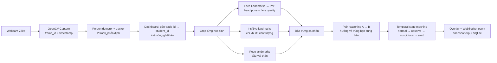

# Module 1 — Phát hiện nghi vấn tư thế/gaze giữa hai học sinh

**Phiên bản:** MVP cho một webcam 720p, khung hình cố định, tối đa 2 học sinh.  
**Mục đích:** tạo cảnh báo có bằng chứng cho giám thị khi một học sinh duy trì hướng đầu/mắt hoặc tư thế về phía bàn/ghế của học sinh còn lại. Đây là module *nghi vấn hành vi*, không tự kết luận hành vi gian lận.

---

## 1. Phạm vi và nguyên tắc thiết kế

### Bài toán thực tế

Không xử lý hai học sinh như hai ảnh crop hoàn toàn độc lập. Quyết định phải dựa trên **quan hệ không gian và thời gian** giữa hai người trong cùng cảnh:

- Học sinh A quay đầu/cúi/nghiêng về phía vùng bàn hoặc vùng thân trên của B.
- Tín hiệu ấy tồn tại đủ lâu, không phải chỉ một khung hình.
- Chất lượng khuôn mặt đủ để suy luận; nếu không đủ thì báo `unknown`, không suy diễn gaze.
- Giám thị kiểm tra ảnh/clip bằng chứng trước khi ra kết luận.

Với webcam 720p, mục tiêu khả thi nhất là nhận biết: `looking_toward_peer`, `looking_down_toward_peer`, `body_turn_toward_peer`, `face_missing`, `standing_or_leaving_seat` (nếu camera nhìn thấy đủ thân người). Không hứa hẹn xác định chính xác đồng tử đang nhìn vào tờ bài nào.

### Ngoài phạm vi Module 1

- Điện thoại, tài liệu, tai nghe: module object detection khác.
- Nhận diện người lạ/xác minh danh tính khuôn mặt: module face recognition khác.
- Nhận biết trao đồ hoặc ký hiệu tay: module hành vi/đối tượng khác.
- Kết luận kỷ luật tự động.

### Điều kiện camera tối thiểu

- Camera cố định, đặt phía trước chếch nhẹ từ trên xuống; cả hai bàn và phần vai–đầu phải luôn trong hình.
- Không xoay/zoom camera trong lúc thi; lưu camera intrinsics sau khi hiệu chuẩn.
- Mỗi khuôn mặt nên rộng ít nhất khoảng 100 px cho head pose. Eye gaze chỉ được bật thử nghiệm khi mặt đủ lớn/rõ (thực nghiệm đặt ngưỡng theo dữ liệu thật, thường cao hơn head pose đáng kể).
- Ánh sáng đều, tránh ngược sáng; mỗi học sinh không che quá nhiều mặt người kia.

Nếu điều kiện chất lượng không đạt, module vẫn theo dõi tư thế đầu/thân nhưng phải tắt hoặc hạ trọng số gaze.

---

## 2. Kiến trúc và luồng dữ liệu



### Ranh giới tích hợp

Module 1 có thể tự chạy detector/tracker cho MVP, nhưng phải bọc nó sau một `TrackingAdapter`. Khi dự án có tracker dùng chung, chỉ thay adapter, không thay logic pose/gaze.

**Input tối thiểu từ tracker:**

```json
{
  "frame_id": 812,
  "timestamp_ms": 1710000123456,
  "frame": "numpy.ndarray BGR",
  "tracks": [
    {"track_id": 11, "bbox_xyxy": [85, 130, 310, 690], "track_confidence": 0.96},
    {"track_id": 24, "bbox_xyxy": [420, 125, 650, 690], "track_confidence": 0.94}
  ]
}
```

Tracker chỉ cho `track_id`, không phải danh tính thật. Dashboard chịu trách nhiệm ánh xạ `track_id → student_id`; khi mất track/đổi ID phải yêu cầu giám thị xác nhận lại.

---

## 3. Quy trình vận hành

1. **Thiết lập cảnh:** giám thị chọn stream, kiểm tra hai người được tracker phát hiện và vẽ vùng ghế/bàn cho A, B trên dashboard.
2. **Gán danh tính:** giám thị click bounding box, gán `student_id` cho từng `track_id`, sau đó khóa sơ đồ ghế.
3. **Hiệu chuẩn cá nhân:** trong 5–10 giây, mỗi học sinh nhìn thẳng và ngồi bình thường. Lưu baseline head pose, vị trí vai, kích thước mặt, cùng camera calibration.
4. **Giám sát:** frame đi qua tracker, landmarks, trích xuất đặc trưng và pair reasoning.
5. **Cảnh báo:** khi event vượt ngưỡng thời gian/điểm, tạo event, snapshot và clip vòng đệm 3–5 giây trước/sau event; dashboard tô bbox tương ứng.
6. **Giám thị xác nhận:** thao tác `confirm`, `dismiss`, hoặc `incorrect_tracking`. Các nhãn này được lưu để hiệu chỉnh ngưỡng và làm dữ liệu huấn luyện sau này.

---

## 4. Các bước xử lý chi tiết

### Bước A — Capture và kiểm soát chất lượng

**Đầu vào:** frame BGR 1280×720 từ OpenCV.  
**Công nghệ:** Python, OpenCV; hàng đợi frame giới hạn để ưu tiên thời gian thực.

Yêu cầu:

- Gán `frame_id`, timestamp đơn điệu và FPS đo được cho mọi frame.
- Không để hàng đợi tăng vô hạn; chậm thì bỏ frame cũ thay vì tạo cảnh báo muộn.
- Lưu một circular buffer JPEG/MP4 nhỏ phục vụ bằng chứng.

### Bước B — Phát hiện người và theo dõi

**Đầu vào:** frame.  
**Đầu ra:** tối đa hai track đang hoạt động với bbox và `track_id` ổn định.  
**Công nghệ:** detector người có sẵn của dự án + ByteTrack (hoặc adapter nhận kết quả tracker của hệ thống).

Yêu cầu:

- Chỉ nhận 2 track đã được giám thị gán ID; người khác xuất hiện tạo event `unexpected_person`, không đánh giá pose/gaze như học sinh.
- Sử dụng ROI ghế cố định để chống đổi ID khi hai người nghiêng hoặc che nhau.
- Khi không thấy track quá `lost_timeout_ms`, đặt trạng thái `track_lost`; không gán hành vi gian lận.

### Bước C — Face/head pose theo từng học sinh

**Đầu vào:** crop người + bbox đã mở rộng nhẹ.  
**Đầu ra:** landmarks, `yaw`, `pitch`, `roll`, face quality và `head_direction`.

**Công nghệ:** MediaPipe Face Landmarker/Face Mesh, OpenCV `solvePnP`, camera intrinsics và distortion coefficients.

Yêu cầu:

- Không dùng trực tiếp góc tuyệt đối; tính `delta_yaw`, `delta_pitch`, `delta_roll` so với baseline từng học sinh.
- Chấm chất lượng: landmark confidence, diện tích mặt, blur, độ che mắt và góc quá nghiêng.
- Làm mượt bằng EMA/Kalman; bỏ qua frame chất lượng thấp thay vì nội suy thành kết luận.

### Bước D — Eye gaze có điều kiện

**Đầu vào:** eye/iris landmarks và face quality.  
**Đầu ra:** `left`, `right`, `down`, `center`, hoặc `unknown` cùng confidence.

**Công nghệ:** MediaPipe Iris/Face landmarks; chuẩn hóa vị trí iris theo eye corners.

Yêu cầu:

- Gaze chỉ là tín hiệu phụ, không phải bộ phân loại cuối.
- Nếu face/eye crop không đạt ngưỡng pixel, bị blur, bị kính phản sáng hoặc mắt không thấy: trả `unknown` và `confidence=0`.
- MVP không fine-tune gaze deep-learning trên webcam 720p; cần benchmark riêng trước khi bổ sung mô hình học sâu.

### Bước E — Phân tích tư thế

**Đầu vào:** crop người.  
**Đầu ra:** vai, mũi, hông (nếu thấy), `torso_turn`, `lean`, `standing_or_leaving_seat`.

**Công nghệ:** MediaPipe Pose Landmarker/Pose.

Yêu cầu:

- So sánh vector vai và độ cao vai/hông với baseline.
- Với phần thân bị bàn che, trả chất lượng thấp thay vì khẳng định đứng lên.
- Tách `face_missing` (không nhìn thấy mặt) khỏi `track_lost` (không tìm thấy người).

### Bước F — Pair reasoning: ngữ cảnh A ↔ B

Đây là phần cốt lõi khác với việc chỉ phân loại crop của từng người.

1. Dashboard lưu polygon `peer_target_zone`: vùng đầu–vai–bàn của B mà A có khả năng hướng tới; tạo tương tự cho B → A.
2. Từ tâm mặt A và `head_direction`, tạo một ray 2D trên ảnh. Đây chỉ là xấp xỉ hướng nhìn, không phải gaze 3D tuyệt đối.
3. Tính độ gần/góc giữa ray của A và vector từ A tới `peer_target_zone` của B.
4. Hợp nhất với gaze, torso turn, head-down và chất lượng tín hiệu thành `pair_score(A→B)`.
5. Làm tương tự cho `pair_score(B→A)`. Có thể ghi nhận event hai chiều, nhưng không coi đó là bằng chứng gian lận mạnh hơn nếu không có thời lượng phù hợp.

Ví dụ score có thể cấu hình:

```text
pair_score = quality_gate × (
  0.45 × head_toward_peer +
  0.20 × eye_toward_peer +
  0.20 × torso_toward_peer +
  0.15 × sustained_duration
)
```

`eye_toward_peer` phải bằng 0 khi gaze là `unknown`. Trọng số và ngưỡng là cấu hình, phải hiệu chỉnh từ video phòng thi thật; không hard-code `yaw > 30°`.

### Bước G — Temporal decision engine

**Công nghệ:** state machine, deque cửa sổ thời gian 2–5 giây, rule engine cấu hình YAML/JSON.

Gợi ý trạng thái:

- `normal`: không có dấu hiệu.
- `observe`: bắt đầu lệch hướng nhưng chưa đủ thời lượng.
- `suspicious`: tỷ lệ frame nghi vấn trong cửa sổ vượt ngưỡng.
- `alert`: giữ đủ lâu, tạo bằng chứng một lần.
- `cooldown`: chặn gửi lặp lại cho cùng loại event trong vài giây.

Ví dụ rule MVP: chỉ sinh `looking_toward_peer` nếu `pair_score ≥ 0.70` trong ít nhất 70% frame hợp lệ của cửa sổ 2 giây. Các ngưỡng ban đầu chỉ là hypothesis để test, không phải tiêu chuẩn cuối.

---

## 5. Output, bằng chứng và lưu trữ

```json
{
  "module": "pose_gaze_pair",
  "event_id": "pg-20260720-000142",
  "student_id": "SV_A",
  "track_id": 11,
  "peer_student_id": "SV_B",
  "action": "looking_toward_peer",
  "state": "alert",
  "confidence": 0.84,
  "duration_ms": 2350,
  "head_pose_delta_deg": {"yaw": 31.2, "pitch": -11.8, "roll": 2.0},
  "gaze_direction": "right",
  "bbox_xyxy": [85, 130, 310, 690],
  "frame_id": 812,
  "timestamp_ms": 1710000123456,
  "evidence": {
    "snapshot_path": "evidence/pg-20260720-000142.jpg",
    "clip_path": "evidence/pg-20260720-000142.mp4"
  }
}
```

Gửi event qua WebSocket; lưu event, cấu hình rule, quyết định của giám thị và đường dẫn bằng chứng vào SQLite. Không ghi raw frame liên tục nếu không cần thiết; cần quy định thời hạn lưu, phân quyền truy cập và sự đồng ý phù hợp cho dữ liệu lớp học.

---

## 6. Công nghệ đề xuất

| Thành phần | Công nghệ | Ghi chú |
|---|---|---|
| Capture/overlay/evidence | OpenCV | BGR frame, drawing, encode snapshot/clip |
| Person tracking | Detector người hiện có + ByteTrack qua `TrackingAdapter` | Có thể thay bằng tracker dùng chung của dự án |
| Face/head pose | MediaPipe Face Landmarker/Face Mesh + OpenCV `solvePnP` | Cần camera calibration và personal baseline |
| Eye signal | MediaPipe Iris/Face landmarks | Chỉ dùng khi chất lượng đủ |
| Body pose | MediaPipe Pose Landmarker | Chạy theo crop mỗi track |
| Logic thời gian | Python state machine + deque/EMA | Có thể phát triển sau thành TCN/LSTM |
| API/realtime | FastAPI + WebSocket | Nếu kiến trúc tổng thể dùng Python backend |
| Lưu event | SQLite (MVP) | Thiết kế schema để chuyển PostgreSQL sau này |
| Cấu hình | YAML/JSON | Ngưỡng, ROI ghế, cooldown, FPS, đường dẫn evidence |

Để đạt realtime trên CPU, chạy detector/tracker theo chu kỳ (ví dụ 5–10 FPS), còn landmarks cho hai track theo chu kỳ phù hợp; mọi feature phải mang timestamp. Nếu máy yếu, ưu tiên head pose và temporal engine, hạ tần suất Pose/Iris trước.

---

## 7. Dataset và kế hoạch dữ liệu

### Nguyên tắc

Dataset hành vi công khai chỉ hữu ích để tham khảo/pretrain; nó không thay thế video đúng bối cảnh camera, bàn ghế và khoảng cách của hệ thống. Dataset **phải giữ nguyên ngữ cảnh hai người trong một frame**, không chỉ lưu crop đơn lẻ.

### Nguồn dữ liệu đề xuất

1. **Dữ liệu tự thu có kiểm soát — bắt buộc cho MVP**
   - Quay đúng webcam 720p, bố trí hai học sinh đúng vị trí triển khai.
   - Mỗi clip 5–15 giây, cả tình huống bình thường và nghi vấn.
   - Các lớp: `normal`, `look_toward_peer`, `look_down_toward_peer`, `body_turn_toward_peer`, `face_missing`, `standing/leaving_seat`, `unknown_quality`.
   - Gán nhãn thời gian bắt đầu/kết thúc, người nguồn, người đích, mức chắc chắn, trạng thái che khuất và điều kiện ánh sáng.

2. **[ExamCheating_Dataset trên Kaggle](https://www.kaggle.com/datasets/ardutraagiginting/exam-cheating-dataset)**
   - Có lớp như `looking_friend`, `normal_act`, `giving_code`, `giving_object`.
   - Dùng để khám phá lớp hành vi hoặc khởi tạo bộ phân loại tham khảo; cần kiểm tra license/provenance và mất cân bằng lớp trước khi dùng.

3. **[MPIIGaze](https://arxiv.org/abs/1711.09017)** và **[GazeCapture](https://gazecapture.csail.mit.edu/explore.php)**
   - Chỉ dùng nghiên cứu/đánh giá thuật toán gaze. Bối cảnh laptop/cận mặt khác đáng kể với webcam phòng thi, nên không được coi là dữ liệu đánh giá cuối.

### Chia dữ liệu và đánh giá

- Chia train/validation/test theo buổi quay và theo người, không chia frame ngẫu nhiên; tránh rò rỉ cùng người/cùng background sang test.
- Báo cáo theo event: precision, recall, F1, false alerts per 30 minutes, mean alert latency, ID-switch rate, FPS.
- Đánh giá riêng `normal` và `looking_toward_peer`; false positive ở lớp `normal` là chỉ số quan trọng nhất.
- Lưu nhãn `confirm/dismiss` của giám thị để cập nhật rule và tạo data version mới.

---

## 8. Lộ trình thực hiện và tiêu chí hoàn thành

### P0 — Hợp đồng tích hợp

- Định nghĩa `FramePacket`, `Track`, `StudentAssignment`, `PoseGazeEvent` bằng Pydantic/dataclass.
- Viết `TrackingAdapter` giả lập để module không phụ thuộc backend tracker hoàn chỉnh.
- **Xong khi:** chạy được một video và log đúng input/output theo schema.

### P1 — Tracking, gán ID và hiệu chuẩn

- Hiển thị hai bbox, `track_id`, `student_id`; dashboard/API gán ID.
- Lưu baseline và ROI bàn/ghế.
- **Xong khi:** hai ID duy trì đúng trong video thử nghiệm, có cơ chế báo mất/đổi track.

### P2 — Head pose và pose cá nhân

- Triển khai Face landmarks, PnP, pose landmarks, quality gate và overlay.
- **Xong khi:** log được feature liên tục, không sinh cảnh báo khi chất lượng camera không đủ.

### P3 — Pair reasoning và temporal alerts

- Triển khai target zones, score A→B/B→A, state machine, cooldown.
- Lưu snapshot/clip evidence và event SQLite.
- **Xong khi:** một hành vi nhìn kéo dài tạo một alert có bằng chứng; cái liếc nhanh không tạo alert.

### P4 — Đánh giá và hiệu chỉnh

- Tạo test set nội bộ có nhãn thời gian; điều chỉnh threshold trên validation, khóa threshold trước khi test.
- **Xong khi:** có báo cáo metric, video lỗi điển hình và danh sách giới hạn đã biết.

Không đưa LSTM/Transformer vào P0–P3. Chỉ cân nhắc mô hình chuỗi sau khi đã có đủ clip hai người được gán nhãn và baseline rule engine rõ ràng.

---

## 9. Prompt sẵn sàng giao cho AI triển khai

```text
Hãy triển khai Module 1 `pose_gaze_pair` bằng Python cho một webcam 720p quan sát đúng hai học sinh trong phòng thi. Module phải phát hiện nghi vấn theo ngữ cảnh quan hệ A→B/B→A, không chỉ phân loại hai crop độc lập.

Yêu cầu bắt buộc:
1. Kiến trúc tách các lớp: capture, TrackingAdapter, student assignment/calibration, landmark extraction, pair reasoning, temporal decision, evidence storage, WebSocket event.
2. TrackingAdapter nhận hoặc tạo danh sách hai track gồm track_id, bbox, confidence. Có mapping track_id → student_id do dashboard/API thiết lập; không dùng face recognition.
3. Dùng MediaPipe Face Landmarker/Face Mesh + OpenCV solvePnP để lấy yaw/pitch/roll tương đối với baseline từng học sinh; dùng MediaPipe Pose cho tín hiệu thân người.
4. Eye gaze chỉ là tín hiệu phụ. Phải có quality gate và trả `unknown` khi mắt/mặt quá nhỏ, mờ hoặc che khuất.
5. Pair reasoning phải dùng vùng mục tiêu (peer_target_zone) do cấu hình/dashboard định nghĩa. Tính score cho A→B dựa trên head direction, eye direction nếu tin cậy, torso direction và thời lượng. Không kết luận đây là gaze 3D chính xác.
6. Dùng temporal state machine normal → observe → suspicious → alert → cooldown; không cảnh báo theo một frame. Mọi threshold để trong YAML.
7. Khi alert, tạo event JSON theo schema, snapshot và clip 3–5 giây trước/sau event; lưu event SQLite và gửi WebSocket.
8. Viết unit tests cho state machine, pair score, quality gate và test integration bằng video có sẵn. Cung cấp README, requirements, cấu hình mẫu và lệnh chạy.
9. Không tự kết luận gian lận: event phải mang ý nghĩa `suspicious behavior`, có confidence và evidence để giám thị xác minh.

Ưu tiên code rõ ràng, có type hints, Pydantic schemas, log có cấu trúc, kiểm soát frame backlog và xử lý mất track. Không thêm object detection, face recognition hoặc audio module ngoài TrackingAdapter tối thiểu.
```
